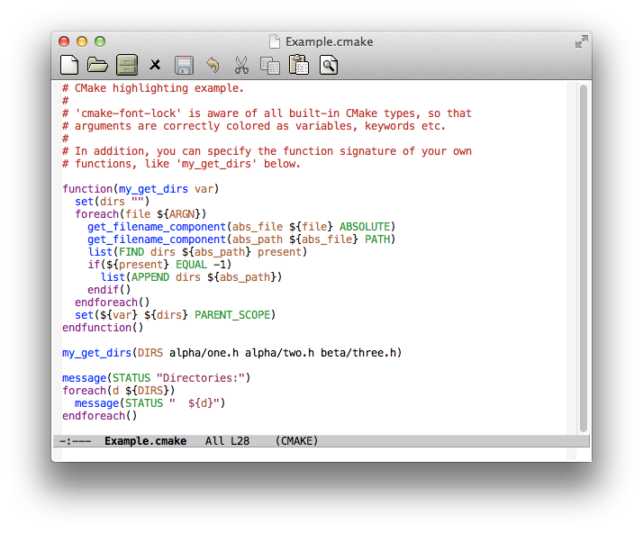

# font-lock-studio - interactive debugger for Font Lock keywords

*Author:* Anders Lindgren 
*Version:* 0.0.7 
*URL:* [https://github.com/Lindydancer/font-lock-studio](https://github.com/Lindydancer/font-lock-studio) 

Interactive debugger for font-lock keywords (Emacs syntax
highlighting rules).

Font Lock Studio lets you *single-step* Font Lock keywords --
matchers, highlights, and anchored rules, so that you can see what
happens when a buffer is fontified. You can set *breakpoints* on or
inside rules and *run* until one has been hit. When inside a rule,
matches are *visualized* using a palette of background colors. The
*explainer* can describe a rule in plain-text English. Tight
integration with *Edebug* allows you to step into Lisp expressions
that are part of the Font Lock keywords.

## Usage

When using the debugger, an *interface buffer* is displayed, it
contains all the keywords and is used for navigation and
visalization of match data.

When Font Lock Studio is started, comments and strings are
pre-colored, as they are part of the earlier *syntactic phase*
(which isn't supported by Font Lock Studio).

Start the debugger by typing <kbd>M-x font-lock-studio RET</kbd>. Press `?`
or see the menu for available commands.

### Why use a debugger?

You might be the author of Font Lock keywords for a major more, you
might simply want to add your own personal highlighting rules, or
you simply would like to know more about how Font Lock keywords
work.

Regardless of your background and ambition, there is a world of
difference between simply reading Font Lock keywords and being able
to step through the rules and exactly see what they do. In fact, as
part of writing Font Lock Studio, I learned some new Font Lock
tricks from various major modes -- despite having 15+ years of
experience with Font Lock.

## Example

For a buffer using `html-mode`, the interface buffer looks the
following. Other major modes typically have more and more complex
rules. The arrow on the left indicates the current active location.
A corresponding arrow in the source buffer is placed at the current
search location.

            ========================
            === Font Lock Studio ===
            ========================
        --------------------------------------------------
    =>  "<\\([!?][_:[:alpha:]][-_.:[:alnum:]]*\\)"
          (1 font-lock-keyword-face)
        --------------------------------------------------
        "</?\\([_[:alpha:]][-_.[:alnum:]]*\\)\\(?::\\([_:[:alpha:]]
        [-_.:[:alnum:]]*\\)\\)?"
          (1
           (if
               (match-end 2)
               sgml-namespace-face font-lock-function-name-face))
          (2 font-lock-function-name-face nil t)
        --------------------------------------------------
        "\\(?:^\\|[ \t]\\)\\([_[:alpha:]][-_.[:alnum:]]*\\)\\(?::
        \\([_:[:alpha:]][-_.:[:alnum:]]*\\)\\)?=[\"']"
          (1
           (if
               (match-end 2)
               sgml-namespace-face font-lock-variable-name-face))
          (2 font-lock-variable-name-face nil t)
        --------------------------------------------------
        "[&%][_:[:alpha:]][-_.:[:alnum:]]*;?"
          (0 font-lock-variable-name-face)
        --------------------------------------------------
        "<\\(b\\(?:ig\\|link\\)\\|cite\\|em\\|h[1-6]\\|rev\\|s\\(?:
        mall\\|trong\\)\\|t\\(?:itle\\|t\\)\\|var\\|[bisu]\\)
        \\([ \t][^>]*\\)?>\\([^<]+\\)</\\1>"
          (3
           (cdr
            (assoc-string
             (match-string 1)
             sgml-tag-face-alist t))
           prepend)
        ==================================================
        Public state:
          Debug on error     : YES
          Debug on quit      : YES
          Explain rules      : YES
          Show compiled code : NO

Press space to single step through all the keywords. "n" will go
the the next keyword, "b" will set a breakpoint, "g" will run to
the end (or to the next breakpoint) and "q" will quit.

In the following screenshot, you will see the debugger in action.
The user has stepped into the last rule (for the second out of
three times) -- the matches are visualized in the regexp, in the
source buffer and in the highlight rule. In addition, *auto
explainer* is active so the rule is described in english.
Furthermore, the red text means a *breakpoint* is set, in this case
on a highlight rule, which is part of a Font Lock keyword rule.

## Features

### Stepping

You can single *step into*, *over*, and *out* of Font Lock
keywords. *Anchored* rules are fully supported. In addition, you
can *run* to the end or to the next breakpoint.

### Breakpoints

You can set breakpoints on part of the keyword, like the matcher
(e.g. the regexp), a highlight rule, or inside an anchored highlight
rule.

If you want to step or run without stopping on breakpoints, prefix
the command with <kbd>C-u</kbd>.

Note that in an anchored rule, you can set a breakpoints either on
the entire rule or on an individual part. In the former case, only
the outer parentheses are highlighted.

### Match Data Visualization

After the *matcher* of a keyword or anchored highlight has been
executed, the match data (whatever the search found) is visualized
using background colors in the source buffer, in the regexp, and
over the corresponding highlight rule or rules. If part of a regexp
or a highlight didn't match, it is not colored, this can for
example happen when the postfix regexp operator `?` is used.

Note that an inner match group gets precedence over an outer group.
This can lead to situations where a highlight rule gets a color
that doesn't appear in the regexp or in the source buffer. For
example, the matcher "\\(abc\\)" will be colored with the color for
match 1, while the higlight rule `(0 a-face)` gets the color for
match 0.

### Normalized keywords

The keywords presented in the interface have been normalized. For
example, instead of

         ("xyz" . font-lock-type-face)

the keyword

          ("xyz" (0 font-lock-type-face))

is shown. See `font-lock-studio-normalize-keywords` for details.

### Explainer

The *explainer* echoes a human-readble description of the current
part of the Font Lock keywords. This help you to understand that
all those `nil`:s and `t`:s in the rules actually mean.

When using the *auto explainer*, Font Lock Studio echoes the
explanation after each command.

### Edebug -- the Emacs Lisp debugger

Tight integration with Edebug allows you to single-step expressions
embedded in the keywords in the interface buffer, and it allows you
to instrument called functions for debugging in their source file.

### Follow mode awareness

The search location in the source buffer is visualized by an
overlay arrow and by updating the point. If the source buffer is
visible in multiple side-by-side windows and Follow mode is
enabled, the search location will be shown in a suitable windows to
minimize scrolling.

## Tips and trix

### The "Hanging Emacs" problem

Traditionally, if you use a function as a matcher and that function
doesn't return -- Emacs hangs and all you can do is to kill it and
restart. (I know from personal experience that it's not uncommon
for functions that parse text to hang -- for example, when you have
forgotten to check for the end-of-buffer.) When using font-lock
studio, you can simply press <kbd>C-q</kbd> to exit.

If you have a source file that hangs Emacs when loaded, first
disable font-lock using <kbd>M-x global-font-lock-mode RET</kbd> before
loading the file, and finally launch Font-Lock studio.

### `cc-mode` keywords

The keywords provided by major modes like `c-mode`, `objc-mode`,
`cpp-mode` that are based on `cc-mode` contain *byte-compiled*
font-lock keywords, which are unreadable and undebugable. To use
corresponding keywords with *uncompiled* code, copy the file
`cc-fonts.el`, replace explicit calls to `byte-compile` with `eval`
and issue <kbd>M-x eval-buffer RET</kbd>.

## Implementation overview

### State-machine fontification engine

Font Lock Studio provides it's own fontification engine, designed
to for things needed by a debugger such as single-stepping and
breakpoints. This fontification engine lacks a lot of features of
the real font-lock fontification engine, such as the speed and the
ability to refontify when the buffer is modified.

The fontification engine can be used without an interface buffer.

### Regexp decomposer

In order for to visualize the groups in regexp:s that corresponds
to matches, they must be located. This requires a non-trivial
*regexp parser*.

## Other Font Lock Tools

This package is part of a suite of font-lock tools.  The other
tools in the suite are:

### [Font Lock Profiler](https://github.com/Lindydancer/font-lock-profiler)

A profiler for font-lock keywords.  This package measures time and
counts the number of times each part of a font-lock keyword is
used.  For matchers, it counts the total number and the number of
successful matches.

The result is presented in table that can be sorted by count or
time.  The table can be expanded to include each part of the
font-lock keyword.

In addition, this package can generate a log of all font-lock
events.  This can be used to verify font-lock implementations,
concretely, this is used for back-to-back tests of the real
font-lock engine and Font Lock Studio, an interactive debugger for
font-lock keywords.

### [Highlight Refontification](https://github.com/Lindydancer/highlight-refontification)

Minor mode that visualizes how font-lock refontifies a buffer.
This is useful when developing or debugging font-lock keywords,
especially for keywords that span multiple lines.

The background of the buffer is painted in a rainbow of colors,
where each band in the rainbow represent a region of the buffer
that has been refontified.  When the buffer is modified, the
rainbow is updated.

### [Faceup](https://github.com/Lindydancer/faceup)

Emacs is capable of highlighting buffers based on language-specific
`font-lock` rules. This package makes it possible to perform
regression test for packages that provide font-lock rules.

The underlying idea is to convert text with highlights ("faces")
into a plain text representation using the Faceup markup
language. This language is semi-human readable, for example:

    «k:this» is a keyword

By comparing the current highlight with a highlight performed with
stable versions of a package, it's possible to automatically find
problems that otherwise would have been hard to spot.

This package is designed to be used in conjunction with Ert, the
standard Emacs regression test system.

The Faceup markup language is a generic markup language, regression
testing is merely one way to use it.

### [Font Lock Regression Suite](https://github.com/Lindydancer/font-lock-regression-suite)

A collection of example source files for a large number of
programming languages, with ERT tests to ensure that syntax
highlighting does not accidentally change.

For each source file, font-lock reference files are provided for
various Emacs versions.  The reference files contains a plain-text
representation of source file with syntax highlighting, using the
format "faceup".

Of course, the collection source file can be used for other kinds
of testing, not limited to font-lock regression testing.

---
Converted from `font-lock-studio.el` by [*el2markdown*](https://github.com/Lindydancer/el2markdown).
