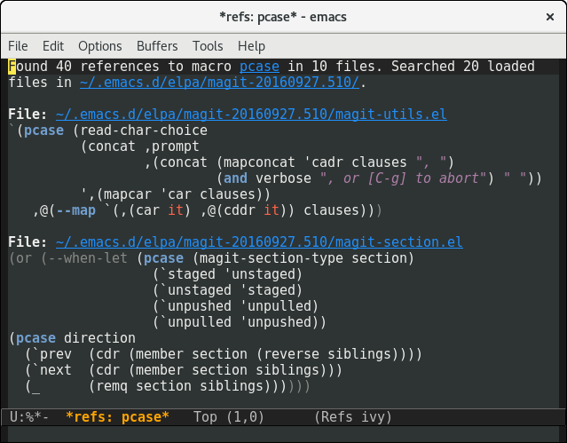

# elisp-refs
[](https://travis-ci.org/Wilfred/elisp-refs)
[](https://coveralls.io/github/Wilfred/elisp-refs?branch=master)
[](http://melpa.org/#/elisp-refs)

elisp-refs is an intelligent code search for Emacs lisp.

It can find references to functions, macros or variables. Unlike a
dumb text search, elisp-refs actually parses the code, so it's never
confused by comments or variables with the same name as functions.


This is particularly useful for finding all the places a function is
used, or finding examples of usage.

Interested readers may enjoy my blog post:
[Searching A Million Lines Of Lisp](http://www.wilfred.me.uk/blog/2016/09/30/searching-a-million-lines-of-lisp/).

## Installation

Install from MELPA (recommended) or just add elisp-refs to your `load-path`.

## Commands available

* `elisp-refs-function` (find function calls)
* `elisp-refs-macro` (find macro calls)
* `elisp-refs-variable` (find variable references)
* `elisp-refs-special` (find special form calls)
* `elisp-refs-symbol` (find all references to a symbol)

These command search all the files currently loaded in your Emacs
instance.

If called with a prefix, you can limit search results to specific
directories. For example:

`C-u M-x elisp-refs-macro RET pcase RET ~/.emacs.d/elpa/magit-20160927.510 RET`

will search for uses of `pcase` in magit:



## Semantic analysis

elisp-refs has *street smarts*: given `(defun foo (bar) (baz))`, it
understands that `bar` is a variable and `baz` is a function.

elisp-refs understands the following forms:

* `defun` `defsubst` `defmacro` `cl-defun`
* `lambda`
* `let` `let*`
* `funcall` `apply`
* sharp quoted expressions (e.g. `#'some-func`)

## Limitations

elisp-refs understands elisp special forms, and a few common
macros. However, it **cannot understand arbitrary macros**.

Therefore elisp-refs will assume that `(other-macro (foo bar))` is a
function call to `foo`. If this is incorrect, you may wish to use the
command `elisp-refs-symbol` to find all references to the `foo` symbol.

If `other-macro` is a common macro, please consider submitting a patch
to `elisp-refs--function-p` to make elisp-refs smarter.

elisp-refs also does not support **indirect calls**.

``` emacs-lisp
;; Since we do a simple syntax tree walk, this isn't treated as a
;; call to foo.
(let ((x (symbol-function 'foo)))
  (funcall x))

;; Similarly, indirect function calls are not treated as
;; function calls.
(defun call-func (x)
  (funcall x))
(call-func 'foo)

;; However, if you use sharp quoting, elisp-refs knows it's a function
reference!
(call-func #'foo)
```

## Running tests

You can run the tests with:

```
$ cask install
$ cask exec ert-runner
```

## Performance

elisp-refs is CPU-intensive elisp and has been carefully optimised. You
can run the benchmark script with:

```
$ cask install
$ ./bench.sh
```

New features are carefully measured to ensure performance does not get
worse.

See elisp-refs-bench.el for more details.

## Changelog

v1.3:

* Refs buffers now have names of the form `*refs: foo*`.

v1.2:

* You can now filter search results to a directory. This is useful
  when working on large elisp codebases, and it's faster too.
* Results buffers now include a link to describe the thing being
  searched for.

v1.1:

* Rebranded to elisp-refs.
* Commands are now autoloaded.
* Added examples to the readme of cases that we can't detect.
* Sharp-quoted function references are now highlighted with context.
* Give more feedback on first run, when we're decompressing .el.gz
  files.
* Searches now default to the symbol at point.

v1.0: Initial release.

## Alternative Projects

**xref-find-references**: This command is included in Emacs 25.1, but
it's based on a text search. It is confused by comments and strings,
and cannot distinguish between functions and variables.

xrefs-find-references is also line oriented, so it does not show the
whole sexp that matched your search. Since it requires text files,
it doesn't search built-in .el.gz files.

**TAGS**: It is possible to record function references in TAGS
files. Whilst [universal-ctags](https://github.com/universal-ctags/ctags) (formerly
known as exuberant-ctags) does provide the ability to find references,
it is not supported in its lisp parser.

etags, the TAGS implementation shipped with Emacs, cannot find
references (to my knowledge).

**[el-search](https://elpa.gnu.org/packages/el-search.html)** allows
you to search for arbitrary forms in elisp files. It's slower, but a
much more general tool. Its design greatly influenced elisp-refs.

**[elisp-slime-nav](https://github.com/purcell/elisp-slime-nav)**
finds definitions, not references. It's a great complementary tool.
