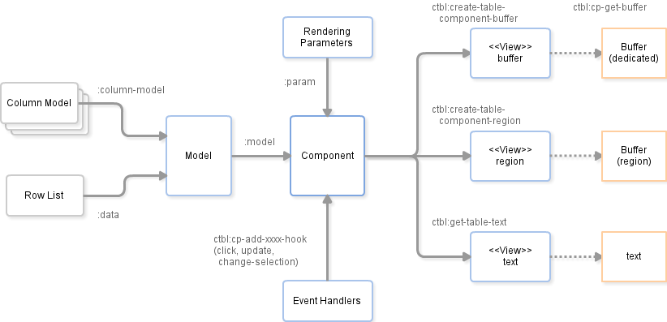

# Table Component for elisp

`ctable.el` is a table component for emacs lisp. Emacs lisp programs can display a nice table view from an abstract data model.
The many emacs programs have the code for displaying table views, such as `dired`, `list-process`, `buffer-list` and so on. So, ctable.el would provide functions and a table framework for the table views.

# Installation

To use this program, locate this file to load-path directory,
and add the following code to your program code.

```lisp
(require 'ctable)
```

# Quick Start

## Hello World

Giving a list of the rows list to the function `ctbl:popup-table-buffer-easy', a simple table buffer is popped out.

```lisp
(ctbl:popup-table-buffer-easy 
 '((1 2 3 4) (5 6 7 8) (9 10 11 12)))
```

Here is the result image. The header titles are generated automatically.


Giving two lists, the latter list is displayed at header titles.

```lisp
(ctbl:popup-table-buffer-easy 
 '((1 2 3 4) (5 6 7 8) (9 10 11 12))
 '(aaa bbb ccc ddd))
```

Here is the result image.


## Basic Use

The objects of ctable are designed by the MVC pattern. Programmers can customize ctable objects to use rich table views in the applications easily.

First, one defines the column model and data model for the user application. The former model defines how the column should be display, the latter one does the contents to display.

Second, one chooses builds the view component with the models.

Here is an illustration for the object relations in this basic case.


Here is a sample code for the model and view.

```lisp
(let* ((column-model ; column model
        (list (make-ctbl:cmodel
              :title "A" :sorter 'ctbl:sort-number-lessp
              :min-width 5 :align 'right)
              (make-ctbl:cmodel
               :title "Title" :align 'center
               :sorter (lambda (a b) (ctbl:sort-number-lessp (length a) (length b))))
              (make-ctbl:cmodel
               :title "Comment" :align 'left)))
       (data
        '((1  "Bon Tanaka" "8 Year Curry." 'a)
          (2  "Bon Tanaka" "Nan-ban Curry." 'b)
          (3  "Bon Tanaka" "Half Curry." 'c)
          (4  "Bon Tanaka" "Katsu Curry." 'd)
          (5  "Bon Tanaka" "Gyu-don." 'e)
          (6  "CoCo Ichi"  "Beaf Curry." 'f)
          (7  "CoCo Ichi"  "Poke Curry." 'g)
          (8  "CoCo Ichi"  "Yasai Curry." 'h)
          (9  "Berkley"    "Hamburger Curry." 'i)
          (10 "Berkley"    "Lunch set." 'j)
          (11 "Berkley"    "Coffee." k)))
       (model ; data model
          (make-ctbl:model
           :column-model column-model :data data))
       (component ; ctable component
        (ctbl:create-table-component-buffer
         :model model)))
  (pop-to-buffer (ctbl:cp-get-buffer component)))
```

Here is the result image.


The models have further options and functions to customize the display and behavior, such as column width, text alignment, sorting and so on. (See Model section)

The key-binding on the table can be customized by the keymap object in the usual way. Then, the user program implements the custom function which refers the focused cell. (See Key Bindings section)

The ctable framework provides some hooks to notify the usual events: click, selection change and update view. (See Event Handling section)

The appearance of the table can be customized, such as foreground and background color, tabular lines. (See Display Parameter section)



## Sample Codes

- samples/simple.el
    - sample codes mentioned above.
- samples/large-table.el
    - large data and async-model samples.
- samples/direx-ctable.el
    - directory tree and table list in collaboration with direx.el
    - ref: https://github.com/m2ym/direx-el



# Advanced Topics

## Column Model

The struct `ctbl:cmodel` is a data type defined by cl-defstruct. This model defines how to display the content along with the each column.

Here is the details of the slot members of `ctbl:cmodel`.

|slot name | description |
|-----|------------------|
|title | **[required]** column header title string. |
|sorter | sorting function which transforms a cell value into sort value. It should return -1, 0 and 1. If nil, `ctbl:sort-string-lessp` is used. |
|align | text alignment: `left`, `right` and `center`. (default: `right`) |
|max-width | maximum width of the column. if `nil`, no constraint. (default: `nil`) |
|min-width | minimum width of the column. if `nil`, no constraint. (default: `nil`) |
|click-hooks | header click hook. a list of functions with two arguments the `ctbl:component` object and the `ctbl:cmodel` one. (default: '(ctbl:cmodel-sort-action)) |

## Data Model

The struct `ctbl:model` is a data type defined by cl-defstruct. This model defines contents to display with column models.

Here is the details of the slot members of `ctbl:model`.

|slot name | description |
|-----|------------------|
|data | **[required]** Table data as a list of rows. A row contains a list of columns. Or, an instance of `ctbl:async-model`. (See the async-model section for details.) |
|column-model | **[required]** A list of column models. |
|sort-state | The current sort order as a list of column indexes. The index number of the first column is 1. If the index is negative, the sort order is reversed. |

## Key Bindings

The keymap `ctbl:table-mode-map` is used as a default keymap on the table. This keymap is a customization variable for the end users, so it should not be modified by applications.

The component functions `ctbl:create-table-component-buffer` and `ctbl:open-table-buffer` receive a `custom-map` argument to override the keymap on the table buffer. Because the functions connect the given keymap to the default keymap `ctbl:table-mode-map` as parent, application program may define the overriding entries.

The component function `ctbl:create-table-component-region` receives a `keymap` argument to define the keymap on the each characters in the table region.

The ctable framework provides some hooks for the usual event cases. In such cases, the application should use the event handlers, instead of defining the keymap. See the next section.

## Event Handling

The ctable provides some hooks for the particular events: clicking, selection changing and updating view. The application program can implement some actions without defining keymaps.

Here is a sample code for the click action:

```lisp
(ctbl:cp-add-click-hook 
 cp (lambda () (message "CTable : Click Hook [%S]" 
        (ctbl:cp-get-selected-data-row cp))))
```

where, `cp` is an instance of `ctbl:component`. The function `ctbl:cp-add-click-hook` adds the given function as an event handler to the component instance. Here are event handler functions:

- `ctbl:cp-add-click-hook` : on click
- `ctbl:cp-add-selection-change-hook` : on selection change
- `ctbl:cp-add-update-hook` : on update view

The function `ctbl:cp-get-selected-data-row` returns a row object which is defined by the model.
Some component access functions are useful for the action handlers.

- `ctbl:cp-get-selected` : returns a Cell-ID object which is currently selected, such as (1 . 2).
- `ctbl:cp-get-selected-data-row` : returns a row data which is currently selected.
- `ctbl:cp-get-selected-data-cell` : return a cell data which is currently selected.

## Display Parameter

The ctable renders tabular form with many rendering parameters. The parameters are set at the slot members of the cl-defstruct `ctbl:param`.

To customize the parameters, one should copy the default parameters like `(copy-ctbl:param ctbl:default-rendering-param)` and set parameters with setter functions. Then, at the building ctable component instance, this parameter object is given by the `:param` keyword.

Here is a sample code for parameter customize.

```lisp
  (let ((param (copy-ctbl:param ctbl:default-rendering-param)))
    (setf (ctbl:param-fixed-header param) t)
    (setf (ctbl:param-hline-colors param)
          '((0 . "#00000") (1 . "#909090") (-1 . "#ff0000") (t . "#00ff00")))
    (setf (ctbl:param-draw-hlines param)
          (lambda (model row-index)
            (cond ((memq row-index '(0 1 -1)) t)
                  (t (= 0 (% (1- row-index) 5))))))
    (setf (ctbl:param-bg-colors param)
          (lambda (model row-id col-id str)
            (cond ((string-match "CoCo" str) "LightPink")
                  ((= 0 (% (1- row-index) 2)) "Darkseagreen1")
                  (t nil))))
    ...
    (setq cp (ctbl:create-table-component-buffer
              :model model :param param))
    ...
    )
```

Here is the details of the slot members of `ctbl:param`.

|slot name | description |
|-----|------------------|
|display-header | if t, display the header row with column models. |
|fixed-header   | if t, display the header row in the header-line area. |
|bg-colors      | '(((row-id . col-id) . colorstr) (t . default-color) ... ) or (lambda (model row-id col-id) colorstr or nil) |
|vline-colors   | "#RRGGBB" or '((0 . colorstr) (t . default-color)) or (lambda (model col-index) colorstr or nil) |
|hline-colors   | "#RRGGBB" or '((0 . colorstr) (t . default-color)) or (lambda (model row-index) colorstr or nil) |
|draw-vlines    | 'all or '(0 1 2 .. -1) or (lambda (model col-index) t or nil ) |
|draw-hlines    | 'all or '(0 1 2 .. -1) or (lambda (model row-index) t or nil ) |
|vertical-line | vertical line character |
|horizontal-line | horizontal line character |
|left-top-corner   | corner character |
|right-top-corner  | corner character |
|left-bottom-corner  | corner character |
|right-bottom-corner  | corner character |
|top-junction | junction character |
|bottom-junction | junction character |
|left-junction | junction character |
|right-junction | junction character |
|cross-junction | junction character |

## View Components

Ctable has three destination components to display the tabular data.

- Independent buffer
- Region in the other buffer
- Text output

### Buffer

The 'buffer' destination displays the tabular view as ordinary Emacs applications do.

The function `ctbl:open-table-buffer` makes a new ctable buffer and displays it by `switch-to-buffer`. The major mode of the ctable buffer is `ctbl:table-mode` and the keymap `ctbl:table-mode-map` is bound.

Using this destination with the `fixed-header` parameter, the application can use the fixed column header.

This destination is easy to use for applications and users, because the buffer is usual application boundary and users know how to use buffers.

### Region

The 'Region' destination embeds the tabular view in the buffer which is managed by the other applications. This destination can give the other applications a nice tabular view.

Let's try a simple demonstration. Evaluate this code in your scratch buffer.

Region destination example:

    ;; Evaluate this code in the scratch buffer
    (require 'ctable)
    (ctbl:create-table-component-region
      :model (ctbl:make-model-from-list
               '((1 2 3 4) (5 6 7 8) (9 10 11 12))))

Then, the tabular view will be embedded in the scratch buffer. You can navigate the ctable view in the buffer. Undoing for the some times, you can remove the ctable view.


Because this destination never interacts anything out of the region and has its own key-binds as a text property, users can easily embed a tabular view in the other applications.

### Text

The 'text' destination generates just a text which represent ctable view. The function `ctbl:get-table-text` returns the text.

### Column Width

TODO...

- Unlimited mode
- Limited mode
    - expand strategy
    - shrink strategy

## ctable Component

An instance of struct `ctbl:component` manages all ctable states, such as models, view, event handlers and some internal status. If an application wants to interact a ctable component, the application should hold the instance and access the component through the following ctable component interface.

### Getting ctbl:component Instance

To access ctable component, the application program should bring an instance of `ctbl:component`.

The instance of the ctable component is stored at following places:

- `buffer` view: the buffer-local variable `ctbl:component`
- `region` view: the text property `ctbl:component`
- `text`   view: N/A

Calling the utility function `ctbl:cp-get-component`, one can obtain the ctable instance at the appropriate places. The stateless functions, such as simple event handler functions, can use this function to get the instance.

The applications those have the state-full operations, however, should hold their own ctable instance for the safety object reference.

### Access Internal Objects

The application can get some internal objects.

- model object : `ctbl:cp-get-model`
- parameter object : `ctbl:cp-get-param`
- buffer object : `ctbl:cp-get-buffer`

### Cursor Position

The application can get the current cursor position and modify the position.

Here, *cell-id* is an object that represents the physical cursor position. *cell-id* is a cons pair which consists of positive integers: `(row . column)`. The index number begins from zero. One can access the values with `car` and `cdr` directly.

- getting cell-id : `ctbl:cp-get-selected`
- moving cursor to cell-id : `ctbl:cp-set-selected-cell`

Note that the position which is indicated by *cell-id* is not the same as the position of the model's row. Because the ctable component changes the row order with sorting by clicking header column, the rows order is not corresponding to the model's ones.

If the application need to get the selected row's data, following functions are available:

- current row data  : `ctbl:cp-get-selected-data-row`
- current cell data : `ctbl:cp-get-selected-data-cell`

### Modifying Model and Update Table View

The application can update the table contents.

Creating a new model instance and setting it to the component with `ctbl:cp-set-model`, the component replaces the model and refresh the buffer.

- replace model instance and update view : `ctbl:cp-set-model`

Another way is updating model instance destructively and refresh the buffer with `ctbl:cp-update`. If the modification of model data is little, this way is lightweight in the viewpoint of calculation and memory usage. However, such the destructive modification complicates the application logic.

- update view with current model state : `ctbl:cp-update`

## Async-Model and Incremental Update

Ctable has incremental data interface which enables the application delay rendering or append subsequent data with the user action. This mechanism can avoid Emacs freezing during visualizing a large amount of data.

### Case 1: Huge Data

When a model which consists of a large number of rows (more than ~1000) is given to the synchronous interface mentioned above, Emacs blocks UI response until rendering is completed. Because the text rendering on the buffer is the heaviest task in ctable, it is effective that the application displays a front part of data and delays the rendering of rest data. In the most cases, users are interesting in the such first page of the large data.

Just wrapping data in async-model via `ctbl:async-model-wrapper`, the application can use this interface.

Here is a sample code:

```lisp
  (let* ((large-data ; large data : 4000 rows
          (loop with lim = 4000
                for i from 0 upto lim
                for d = (/ (random 1000) 1000.0)
                collect 
                (list i d (exp (- (/ i 1.0 lim))) (exp (* (- (/ i 1.0 lim)) d)))))
         (async-model ; wrapping a large data in async-data-model
          (ctbl:async-model-wrapper large-data))
         (cp ; just build a component 
          (ctbl:create-table-component-buffer
           :model
           (make-ctbl:model
            :column-model
            (list (make-ctbl:cmodel :title "row")
                  (make-ctbl:cmodel :title "delta")
                  (make-ctbl:cmodel :title "exp")
                  (make-ctbl:cmodel :title "exp-delta"))
            :data async-model))))
    (pop-to-buffer (ctbl:cp-get-buffer cp)))
```

And here is the result image:


### Case 2: Asynchronous Retrieving

In the case of retrieving large data asynchronously from an another process or remote servers, the application needs to append retrieved partial data without blocking UI response nor updating whole table view.

Defining some functions in `ctbl:async-model` struct, the application can control asynchronous data retrieving and updating table view.

Here is a minimum sample code:

```lisp
(defun async-response (row-num len responsef errorf &rest a)
  (funcall responsef
           (loop for i from row-num below (+ row-num len)
                 collect
                 (list i (* i i) (* i i i) (sqrt i)))))
 
(ctbl:open-table-buffer-easy
 (make-ctbl:async-model :request 'async-response) ; defining async-model
 '("int" "square" "cube" "root"))
```

In this sample code, we defined just a `request` function in `ctbl:async-model`.
The `request` function should have 4 arguments:

- `row-num`   : an index number of the requested first row
- `len`       : a number of requested rows
- `responsef` : the continuation function to which the result rows should be passed
- `errorf`    : the error continuation function

Here is the result image:


#### ctbl:async-model struct

|slot name | description |
|-----|------------------|
|request  | Data request function mentioned above. |
|init-num | Initial row number. (Default 20)  |
|more-num | Increase row number. (Default 20) |
|reset    | Reset function which is called when user executes update command. (Can be nil) |
|cancel   | Cancel function of data requesting. (Can be nil) |

For forward compatibility, these callback functions should have a `&rest' keyword at the end of argument list.

For more complete example, see the demo function `ctbl:async-demo` at `samples/large-table.el`.

### Sorting Async-Model

The ctable doesn't provide default sorting function `ctbl:cmodel-sort-action` for the async-model data, because ctable can not receive whole rows of async-model.

If sorting function is needed, the application program must implement it manually.

* * * * *

(C) 2012,2013  SAKURAI Masashi  All rights reserved.
m.sakurai at kiwanami.net
