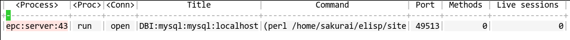

# EPC : The Emacs RPC

This program is an asynchronous RPC stack for Emacs.  Using this
RPC stack, the Emacs can communicate with the peer process smoothly.
Because the protocol employs S-expression encoding and consists of
asynchronous communications, the RPC response is fairly good.

Current implementations for the EPC are followings:
- epcs.el : Emacs Lisp implementation (this project)
- RPC::EPC::Service : Perl implementation (this project)
  - You can get this module by CPAN or PPM.
- python-epc : Python implementation
  - http://python-epc.readthedocs.org/en/latest/
- ruby-elrpc : Ruby implementation
  - You can get `elrpc` from rubygems.
  - https://github.com/kiwanami/ruby-elrpc
- nodejs-elrpc : Node.js implementation
  - You can get `elrpc` from npm.
  - https://github.com/kiwanami/node-elrpc

The current status is beta. This library needs more applications to
confirm stability of the API and robustness of the implementation.

## Applications

Projects using EPC:

- [Emacs DBI](https://github.com/kiwanami/emacs-edbi):
  Database GUI and API for Emacs
- [Emacs Jedi](https://github.com/tkf/emacs-jedi):
  Python auto-completion for Emacs
- [Emacs Webkit](http://www.emacswiki.org/emacs/WebKit)
  Full-featured browser in Emacs

## Sample Code

Here is a client code.

```lisp
(require 'epc)

(setq epc (epc:start-epc "perl" '("echo-server.pl")))

(deferred:$
  (epc:call-deferred epc 'echo '(10))
  (deferred:nextc it 
    (lambda (x) (message "Return : %S" x))))

(deferred:$
  (epc:call-deferred epc 'add '(10 40))
  (deferred:nextc it 
    (lambda (x) (message "Return : %S" x))))

;; calling synchronously
(message "%S" (epc:call-sync epc 'echo '(10)))

;; Request peer's methods
(message "%S" (epc:sync epc (epc:query-methods-deferred epc)))

(epc:stop-epc epc)
```

Here is a server code in perl.

```perl
#!/usr/bin/perl

use RPC::EPC::Service;

sub echo_test {
    my $methods = {
    
        'echo' => [sub {
            my $args = shift;
            return $args;
        },"args","just echo back arguments."],
        
        'add' => sub {
            my $args_ref = shift;
            my ($a,$b) = @$args_ref;
            return $a + $b;
        }
    };
    my $server = RPC::EPC::Service->new(0, $methods);
    $server->start;
}

echo_test();
```

Here is the equivalent server code in emacs lisp.

```lisp
(require 'epcs)

(let ((connect-function
       (lambda (mngr) 
         (epc:define-method mngr 'echo (lambda (&rest x) x) "args" "just echo back arguments.")
         (epc:define-method mngr 'add '+ "args" "add argument numbers.")
         )) server-process)

  (setq server-process (epcs:server-start connect-function))
  (sleep-for 10)
  (epcs:server-stop server-process))
```

The elisp server code should be started with some arguments (batch starting and indicating load paths) like the following code:

```lisp
(setq epc (epc:start-epc "emacs" '("-L" ".." "-L" "~/.emacs.d/elisp" "-batch" "-l" "deferred" "-l" "concurrent" "-l" "epc" "-l" "epcs" "-l" "echo-server.el")))
```

# Installation

## Package installation

If you use package.el with MELPA (http://melpa.org/), you just select the package `epc` and install it.

## Manual installation

This program depends on following programs:

- deferred.el, concurrent.el / https://github.com/kiwanami/emacs-deferred
- ctable.el   / https://github.com/kiwanami/emacs-ctable

Place those programs and this one (epc.el) in your load path and add following code.

```lisp
(require 'epc)
```

# API Document

This section describes the overview of the EPC and how to use API.

### API Overview

The EPC uses a peer-to-peer-architecture. After the connection is established, both peers can define remote methods and call the methods at the other side.

Let we define the words *server* and *client*. *Server* is a process which opens a TCP port and waiting for the connection. *Client* is a process which connects to the *server*. In most cases, a *client* process starts a *server* process. Then, the *server* process provides some services to the *client* process.

This diagram shows the API usage and the relation of processes.


### Object Serialization

All values which are transferred as arguments and return values between processes, are encoded into the S-expression text format.

The EPC uses S-expression as an object serialization format, not JSON.
In these days, JSON is widely employed and many environments has some JSON serializers.
However, JSON is not the best format for IPC from the point of view of serialization speed.
The current Emacs implementation (23.x and 24.x) can read/write JSON format with json.el about 5-10 times slower than S-expression one.
Since the Emacs interpreter is often slower than other interpreters or VMs, we should choose a format so that Emacs can deal faster.
In addition, S-expression has good expression power as well as JSON does.
So, the EPC stack uses S-expression, though we need more work for writing S-expression serializers on the peer side.
(In the future, we may use JSON when Emacs can read/write JSON in native library...)

Simple list structure and some primitive types can be transferred. Complicated objects, such as buffer objects, can not be serialized. The EPC stack doesn't provide transparent remote object service, that is ORB.

The EPC stack can translate following types:

- nil
- symbol
- number
- string
- list
- complex object of list and alist.

The elisp function `prin1` is employed for the serialization from objects to string.

The peer EPC stack decodes the S-expression text and reconstructs appropriate objects in the particular language environment.

You may want to translate an `alist` as a collection object of key-value pairs transparently, so called `Hash`. However, because we can not distinguish between alist and nested list, it is responsible for the programmer to exchange the alist objects and the hash objects.

### EPC Manager Object (epc:manager)

The struct `epc:manager` defines all information for an EPC activity, such as the connection status, remote methods and sessions. Many API functions needs the instance object as an argument. You, however, doesn't have to learn the internal slots and detailed implementations.

An instance of the struct `epc:manager` is created by calling the initialization function `epc:start-epc`. You can stop the EPC connection with calling the termination function `epc:stop-epc`.

### Start EPC (epc:start-epc)

* `epc:start-epc (server-prog server-args)`
  * Start the epc server program, establish the connection and return an `epc:manager` object.
  * Argument
     * `server-prog`: a path string for the server program
     * `server-args`: a list of command line arguments
  * Return
     * This function blocks the evaluation and returns an `epc:manager` object.
  * Error
     * If the server prints out non-numeric value in the first line or
       does not print out the port number in three seconds, it is
       regarded as start-up failure.

The established EPC session is registered to the global variable for the connection management interface. (See the Management Interface section.)

### Stop EPC (epc:stop-epc)

* `epc:stop-epc (mngr)`
  * Disconnect the connection and kill the server process.
  * If the `epc:manager` object has exit hooks, this function executes those clean-up hooks.
  * Argument
     * an `epc:manager` object

### Define Remote Method (epc:define-method)

* `epc:define-method (mngr method-name task &optional arg-specs docstring)`
  * Define a remote method
  * Argument
     * `mngr`: `epc:manager` object
     * `method-name`: the method name
     * `task`: function symbol or lambda
     * `arg-specs`: argument signature for the remote method [optional]
     * `docstring`: short description for the remote method [optional]
  * Return
     * an `epc:method` object

The documents are referred by the peer process for users to inspect the methods.

### Call Remote Method (epc:call-deferred, epc:call-sync)

* `epc:call-deferred (mngr method-name args)`
  * Call the remote method asynchronously.
  * Argument
     * `mngr`: `epc:manager` object
     * `method-name`: the method name to call
     * `args`: a list of the arguments
  * Return
     * Deferred object
     * See the next section for the error handling
* `epc:call-sync (mngr method-name args)`
  * Call the remote method synchronously.
  * Argument
     * `mngr`: `epc:manager` object
     * `method-name`: the method name to call
     * `args`: a list of the arguments
  * Return
     * a result from the remote method

### Error Handling

The remote method calling may raise the error. The error has two types, the peer's program (`application-error`) and the EPC stack (`epc-error`).

The `application-error` is a normal error which is caused by peer's program, such as 'division by zero', 'file not found' and so on. The programmers are responsible to this type errors, recovering error handling or just fixing bugs.

The `epc-error` is a communication error which is caused by EPC stack, such as 'connection closed', 'method not found', 'serialization error' and so on. This type errors are caused by environment problems, bugs of peer's program, our side one or the EPC stack.

Here is a sample robust code:

```lisp
(deferred:$
    (epc:call-deferred mngr "a-method" '(1 2))
    (deferred:next it
        (lambda (x)
            ;; Normal return
            ;; x: result value
            ))
    (deferred:error it
        (lambda (err)
         (cond
          ((stringp err)
            ;; application error
            ;; err: error message
           )
          ((eq 'epc-error (car err))
            ;; epc error
            ;; err: (cadr err) -> error information
           )))))
```

In the case of synchronous calling, a signal will be thrown immediately.

### Utilities

* `epc:live-p (mngr)`
  * If the EPC stack for `mngr` is eastablished, this function returns `t`.
* `epc:query-methods-deferred (mngr)`
  * Return a list of `epc:method` objects for the peer process.

### Define Server

Following functions require the `epcs` package.

* `epcs:server-start (connect-function &optional port)`
  * Start EPC manager stack and initialize the manager with connect-function.
  * Argument
     * `connect-function`: a function symbol or lambda with one argument `mngr`, in which function the manager should define some remote methods.
     * `port`: TCP port number. (default: determined by the OS)
  * Return
     * process object

Here is a sample code for the EPC server:

```lisp
(require 'epcs)

(let ((connect-function
       (lambda (mngr) 
         (epc:define-method mngr 'echo (lambda (x) x) "args" "just echo back arguments.")
         (epc:define-method mngr 'add '+ "args" "add argument numbers.")
         )) server-process)

  (setq server-process (epcs:server-start connect-function))

  ;; do something or wait for clients

  (epcs:server-stop server-process))
```

* `epcs:server-stop (process)`
  * Stop EPC manager stack.
  * Argument
     * `process`: process object

### Debug

Because the EPC stack is designed to work asynchronously, sometimes you can not use the debugger for the own programs. Then, logging is useful to analyze the troubles.

The EPC has some debug functions for analyzing low level communication.

* `epc:debug-out`
  * If this variable is non-nil, the EPC stack records events and communications into the debug buffer.
* `epc:debug-buffer`
  * debug buffer name (default: '*epc log*')
* `epc:log (&rest args)`
  * logging debug messages

## Management Interface

The EPC has a management interface for the EPC connections. Users can check the current connection status, inspect method specs and terminate the connection.

### Current Connections

Executing `M-x epc:controller`, you can display the list of current established connections.



This table shows following information:

| Column        | Note                                                        |
|---------------|-------------------------------------------------------------|
| Process       | Process name                                                |
| Proc          | Process status (`process-status` for the process)           |
| Conn          | Connection status (`process-status` for the TCP connection) |
| Title         | Connection title which is defined by the EPC user program.  |
| Command       | Process command and arguments.                              |
| Port          | TCP port which is opened by the remote process.             |
| Methods       | Number of methods which are defined at the Emacs side.      |
| Live sessions | Number of sessions which are waiting for a return value.    |

This management buffer provides following key-bind:

| Key   | Command                                     | Note                                                                                 |
|-------|---------------------------------------------|--------------------------------------------------------------------------------------|
| g     | `epc:controller-update-command`             | Refresh the table.                                                                   |
| R     | `epc:controller-connection-restart-command` | Restart the selected connection.                                                     |
| D,K   | `epc:controller-connection-kill-command`    | Kill the selected process and connection.                                            |
| m,RET | `epc:controller-methods-show-command`       | Display a method list of the remote process. (See the next sub-section for details.) |
| B     | `epc:controller-connection-buffer-command`  | Display the connection buffer.                                                       |

### Remote Method List

Displaying a method list, you can inspect the methods which are defined by the remote process.


This table shows following information:

| Column      | Note                             |
|-------------|----------------------------------|
| Method Name | Method name to call.             |
| Arguments   | [optional] Argument names.       |
| Document    | [optional] Method spec document. |

Here, 'Arguments' and 'Document' columns may be blank, because those are not essential slots.

| Key | Command                               | Note                                                     |
|-----|---------------------------------------|----------------------------------------------------------|
| e   | `epc:controller-methods-eval-command` | Evaluate the selected remote method with some arguments. |
| q   | `bury-buffer`                         | Bury this buffer.                                        |

# Implementation

This section describes the EPC architecture and the wire-protocol so as to implement the peer stacks.

## Protocol Details

The EPC protocol is based on the SWANK protocol.

- [Understanding SLIME (Using Emacs and Lisp Cooperatively)](http://bc.tech.coop/blog/081209.html)

### Message Envelope

A message consists of 6 bytes content-length and a subsequent payload content.
The payload content is a S-expression string. The S-expression is a cons cell, car is message type symbol and cdr is message body list.

- PAYLOAD-LENGTH  : 24-bit hex-encoded integer
- PAYLOAD-CONTENT : S-expression, text, utf-8
  - (MESSAGE-TYPE . MESSAGE-BODY-LIST)

The message type can be chosen from `call`, `return`, `return-error`, `epc-error` and `methods`.
The message body varies according to the message type.

- MESSAGE-TYPE : `call` | `return` | `return-error` | `epc-error` | `methods`
- MESSAGE-BODY-LIST : (Dependent on message types.)

### Message [call]

This message represents calling a peer's method.

- MESSAGE-BODY-LIST : `(UID METHOD-NAME ARGS)`
  - UID : The session ID, which is an unique ID generated by the caller side.
  - METHOD-NAME : A symbol for method name.
  - ARGS : A list of method arguments.

### Message [return]

This message represents a return value for normal finish of the method calling.

- MESSAGE-BODY-LIST : `(UID RETURN-VALUE)`
  - UID : The session ID to return.
  - RETURN-VALUE : A return object.

### Message [return-error]

This message represents an application error, which is due to the application.

- MESSAGE-BODY-LIST : `(UID ERROR-MESSAGE)`
  - UID : The session ID to return.
  - ERROR-MESSAGE : An error message.

### Message [epc-error]

This message represents an EPC error, which is due to the EPC stack.

- MESSAGE-BODY-LIST : `(UID ERROR-MESSAGE)`
  - UID : The session ID to return.
  - ERROR-MESSAGE : An error message.

### Message [methods]

This message represents a method query.

- MESSAGE-BODY-LIST : `(UID)`
  - UID : The session ID, which is an unique ID generated by the caller side.

The response message is returned by the `return` message.

## EPC Internal

The EPC is developed on `deferred.el` and `concurrent.el`. The library `deferred.el` provides primitive an asynchronous framework and `concurrent.el` does concurrent programing components.

- [deferred.el document](https://github.com/kiwanami/emacs-deferred/blob/master/README.markdown)
- [concurrent.el document](https://github.com/kiwanami/emacs-deferred/blob/master/README-concurrent.markdown)

The EPC user should learn asynchronous programing on `deferred.el`. The components of `concurrent.el` are just internally used at `epc.el`.


Here is a diagram for the `epc.el` architecture, which diagram may be helpful for code reading of `epc.el`.


## Other Stacks

- perl EPC document  http://search.cpan.org/~kiwanami/RPC-EPC-Service-v0.0.7/lib/RPC/EPC/Service.pm
- python EPC document  http://python-epc.readthedocs.org/en/latest/
- ruby EPC document https://github.com/kiwanami/ruby-elrpc/blob/master/README.md
- nodejs EPC document https://github.com/kiwanami/node-elrpc/blob/master/readme.md

# License

EPC is licensed under GPL v3.

# Acknowledgment

I received generous support from @tkf. Thanks!

----
(C) 2012, 2013, 2014, 2015 SAKURAI Masashi. m.sakurai at kiwanami.net
