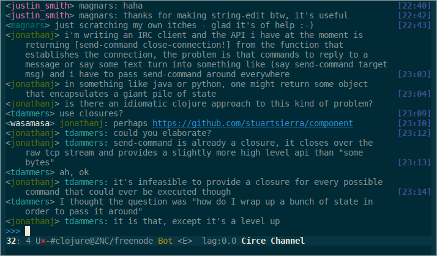

# Circe, a Client for IRC in Emacs

[](https://travis-ci.org/jorgenschaefer/circe)
[](http://stable.melpa.org/#/circe)

## Overview


Circe is a Client for IRC in Emacs. It tries to have sane defaults,
and integrates well with the rest of the editor, using standard Emacs
key bindings and indicating activity in channels in the status bar so
it stays out of your way unless you want to use it.

Complexity-wise, it is somewhere between rcirc (very minimal) and ERC
(very complex).

## Screenshot



## Installation

### Dependencies

In order to securely connect to an IRC server using TLS, Circe requires the
[GnuTLS](https://www.gnutls.org/) binary. On Debian-based
GNU+Linux-distributions, you can install it likes this:

```Shell
apt install gnutls-bin
```

### `package.el`

Make sure you have MELPA Stable added to your package sources. To your
.emacs, add this:

```Lisp
(require 'package)
(add-to-list 'package-archives
             '("melpa-stable" . "http://stable.melpa.org/packages/") t)
(package-initialize)
```

Then, use `package-install` to install Circe:

```
M-x package-install RET circe RET
```

After this, `M-x circe` should work.

### Development Version

In a shell:

```Shell
mkdir -d ~/.emacs.d/lisp/
cd ~/.emacs.d/lisp
git clone git://github.com/jorgenschaefer/circe.git
```

Then add the following to your `.emacs` file:

```Lisp
(add-to-list 'load-path "~/.emacs.d/lisp/circe")
(require 'circe)
```

The next time you start your Emacs, you should be able to use
`M-x circe` to connect to IRC.

## Connecting to IRC

To connect to IRC, simply use `M-x circe RET irc.freenode.net RET
RET`. This will connect you to Freenode. You can join us on
`#emacs-circe` by using `/join #emacs-circe` in the server buffer.

A more elaborate setup would require you to edit your init file and
add something like the following:

```Lisp
(setq circe-network-options
      '(("Freenode"
         :tls t
         :nick "my-nick"
         :sasl-username "my-nick"
         :sasl-password "my-password"
         :channels ("#emacs-circe")
         )))

```

With this in your configuration, you can use `M-x circe RET Freenode
RET` to connect to Freenode using these settings.

_Please note:_ Circe uses the `openssl` or `gnutls-cli` command line
programs to connect via TLS. These tools do not by default verify the
server certificate. If you want to verify the server certificate,
customize the `tls-connection-command` variable.

## Features

- Sensible defaults
- Tab completion
- Nick highlighting
- Logging
- Spell checker
- Ignore feature that also hides users who talk to users on your
  ignore list
- Ignored messages can be toggled so they show up and then hidden
  again
- TLS/SSL support
- SASL authentication support
- Nickserv authentication, automatic ghosting, and nick re-gain
- Auto-join
- Ability to reduce join/part/quit spam from lurkers
- Automatic splitting of long lines at word boundaries
- Netsplit handling
- Activity tracking in the mode line
- Fully customizeable message display
- Topic changes can be shown as a diff
- Automatic linking of Emacs Lisp symbols, RFCs, PEPs, SRFIs, Github
  issues, etc.
- Automatic splitting of outgoing messages at word boundaries to
  adhere to IRC protocol limitations
- Flood protection
- Nickname coloring (via the `circe-color-nicks` module)
- Lag monitoring (via the `circe-lagmon` module)
- Automatic pasting to a paste site for long messages (via the
  `lui-autopaste` module)
- Bar marking the last read position (via the `lui-track-bar` module)

## Documentation

Please see the Wiki for further information:

https://github.com/jorgenschaefer/circe/wiki
