# company-coq

IDE extensions for Proof-General's Coq mode. See features below or jump to [Setup](#setup). After setting-up, try the tutorial with `M-x company-coq-tutorial`.

## Features

### Completion

* Auto-completion of [math symbols](img/tactic-completion-doc.png) (using company-math).

* Auto-completion of [theorems and tactics](img/defun-completion.png) defined in the same buffer.

* Fuzzy auto-completion of (most of) Coq's [tactics](img/command-completion-doc.png) and [commands](img/symbol-completion-doc.png), with snippets auto-extracted from the manual.

* Fuzzy auto-completion of library [module names](img/module-completion.png) in `Import` commands.

* Auto-completion of [hypotheses](img/hypotheses-completion.png) in proof contexts, and of section and modules names.

* Auto-completion of [search results](img/search-completion.png): after running a search, results are available as completions.

* Easy access to [Proof-General's templates](img/lemma-completion.png) (using yasnippet), with smart templates for sections and modules.

### Proof-General Extensions

* [Documentation](img/keyword-completion-doc.png) for (most) auto-completion entries, with excerpts from the manual shown directly in Emacs.

* [Documentation](img/errors-doc.png) for many error messages, with automagic matching of the last error message against errors documented in the manual.

* Interactive lemma extraction: press <kbd>C-c C-a C-x</kbd> to extract the current goal into a separate lemma, keeping the hypotheses of your choice.

* Convenient snippets: easily insert [new `match` cases](img/match-function.gif) and [`match goal` rules](img/match-goal.gif).

* Visual [word diff](img/unification.png) of large unification error messages (<code>The term "<i>blah</i>" has type "<i>huge blob</i>" while it is expected to have type "<i>slightly different blob</i>"</code>).

* Interactive [proof script outline](img/outline.png) and [in-buffer folding](img/folding.png).

* Basic project search (search for instances of the word at point in neighboring files).

* Extended [font beautification](img/prettify.png): keywords are transparently replaced with the corresponding symbols (`⊢⊤⊥→⇒λ∀∃∧∨¬≠⧺𝓝ℤℕℚℝ𝔹𝓟`), and the goals line (`========`) actually looks like a line (`════════`).

* Minimal [quick help](img/inline-docs.gif) (inline documentation).

* Automatic [highlighting](img/deprecated.png) of deprecated forms (`assert (_ := _)`, `SearchAbout`, etc.).

* Occur in `*coq*` buffer (`company-coq-search-in-coq-buffer`).

* Source view for same-buffer definitions.

### Advanced features

(These require a [patched](https://github.com/coq/coq/pull/56) [version](https://github.com/coq/coq/pull/64) of `coqtop`)

* Auto-completion of all known [types and theorems](img/symbol-completion.png) with [annotations](img/symbol-completion-doc.png), and of all [user-defined tactics](ltac-completion.png) and [tactic notations](img/tactic-notation-completion.png).

* [Source view](img/source-view.png) for auto-completed symbols and [user-defined tactics](img/source-view-ltac.png) (needs `.v` files). Works to a limited extent with an unpatched `coqtop`.


## Setup

Note: You need a version of Emacs ≥ 24 for this to work properly. You can check which version you are running with <kbd>M-x emacs-version RET</kbd>. Note that some features, like beautification of symbols or syntax highlighting in the manual, only work with emacs ≥ 24.4.

### Proof-General

```bash
sudo apt-get install proof-general
```

(or [from source](http://proofgeneral.inf.ed.ac.uk/releases/ProofGeneral-4.2.tgz))

### company-coq

`company-coq` is on [MELPA](http://melpa.org/#/getting-started). First add the following to your `.emacs` and restart emacs.

```elisp
(require 'package)
(add-to-list 'package-archives '("melpa" . "http://melpa.org/packages/") t)
(package-initialize)
```

Then type `M-x package-refresh-contents RET` followed by `M-x package-install RET company-coq RET` to install and byte-compile `company-coq` and its dependencies. Some of them will produce a few warnings. That's ok.

## Configuration

Add the following to your `.emacs`

```elisp
(package-initialize)

;; Open .v files with Proof-General's coq-mode
(require 'proof-site)

;; Load company-coq when opening Coq files
(add-hook 'coq-mode-hook #'company-coq-initialize)
```

## Quick start guide

*You can check out the interactive tutorial by pressing `M-x company-coq-tutorial`.*

`company-coq` should be pretty transparent. Completion windows will pop up when `company-coq` has suggestions to make. By default, this would be when you start writing a tactic name or a command. You can also launch manual completion by using <kbd>C-RET</kbd> (or whatever was originally assigned to `proof-script-complete` in Coq mode).

Once auto-completion has started, the following key bindings are available:

* <kbd>RET</kbd> selects a completion
* <kbd>C-g</kbd> interrupts completion.
* <kbd>C-h</kbd> and <kbd>&lt;f1></kbd> display documentation for the currently highlighted keyword or identifier.
* <kbd>C-M-v</kbd> scrolls down in the documentation window.
* <kbd>C-w</kbd> opens the full documentation, scrolled to the current keyword. For symbols, <kbd>C-w</kbd> opens source view.

Selecting a completion often inserts a snippet with holes at the current point (`company-coq` uses `yasnippet` as the snippet backend). You can move between holes by using <kbd>&lt;tab></kbd> and <kbd>S-&lt;tab></kbd>. Some snippets (like Print Instances) include multiple choices.

Loading `company-coq` also binds the following keys:

* <kbd>M-RET</kbd> inserts a new `match` case (`| _ => _`).
* <kbd>M-S-RET</kbd> inserts a new `match goal` rule (`| [ H: _ |- _ ] => _`).
* <kbd>C-c C-a C-x</kbd> extracts the current goal into a separate lemma.
* <kbd>C-c C-a C-e</kbd> tries to match the last output to a documented error message, and displays the relevant section of the manual if it finds one.
* <kbd>C-down-mouse-1</kbd> (i.e. <kbd>C-click</kbd>) shows an inline quick help box for the symbol under point. The box disappears when the mouse is released. Pressing the <kbd>&lt;menu></kbd> key also works.
* <kbd>C-c C-,</kbd> opens an outline of the code in a separate buffer (using `occur`).
* <kbd>C-c C-/</kbd> folds the current code block, or all blocs in the file if repeated.
* <kbd>C-c C-\\</kbd> unfolds the current code block, or all blocs in the file if repeated.
* <kbd>C-c C-&</kbd> looks up (grep) the current word in files in the current directory subtree.
* <kbd>M-x company-coq-diff-unification-error</kbd> parses the last unification error, and shows a diff of the two types that can't unify.

## Tips

* Module completion is fuzzy: you can type `Require Import C.N..Ab.ZPa` and press <kbd>RET</kbd> to insert `Coq.Numbers.Integer.Abstract.ZParity`.
* Tactics completion is fuzzy too: typing `setrewin` and pressing <kbd>RET</kbd> is enough to insert <code>setoid_rewrite <i>term</i> in <i>ident</i></code>. You can (and must) omit spaces: `SLD` will insert `Set Ltac Debug` (of course `SetLtDeb` will also work), and `ULD` will insert `Unset Ltac Debug`.
* Using <kdb>M-S-RET</kbd> to insert new cases in a `match goal` saves a lot of time (and finger contortions).
* The point-and-click feature (quick help) also works in non-graphic mode, if you enable `xterm-mouse-mode`.
* `company-coq` improves on some of Proof-General's features. Try <kbd>C-c C-a RET nat RET</kbd>.

## Screenshots

### Auto-completion of tactics with documentation

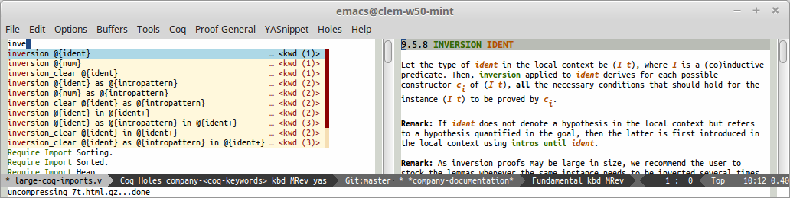

### Auto-completion of commands with documentation


### Auto-completion of local definitions

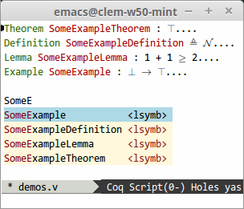

### Fuzzy auto-completion of module names

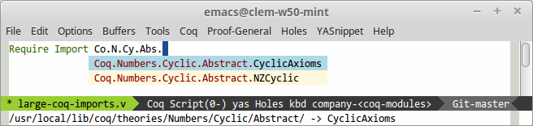

### Auto-completion of hypotheses

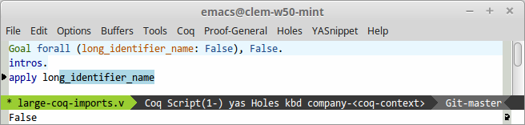

### Auto-completion of search results


### Keyword beautification

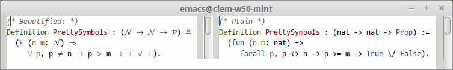

### Quick help (inline docs)


Currently works for symbols and user-defined tactics (prover must be started)

### Neat snippets


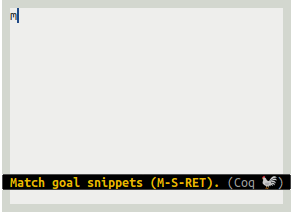

### Highlighting of deprecated forms


### Documentation for (documented) error messages

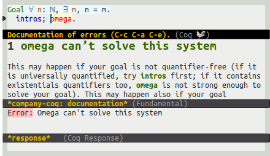

### Outline and folding

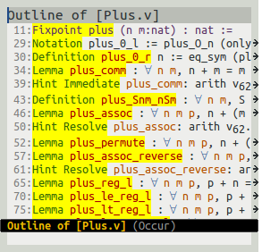
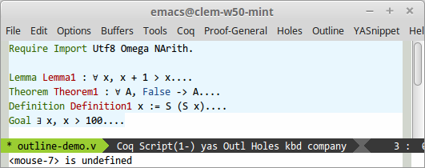

### Auto insertion of Proof-General's templates

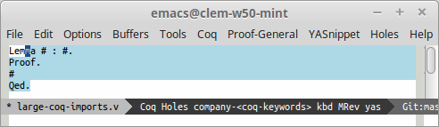

### Unicode math symbols


### Diffs of unification errors

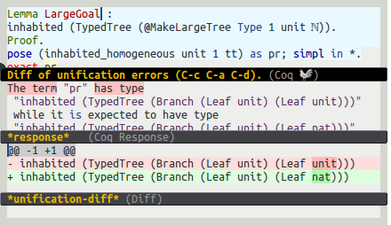

### Auto-completion of theorems and types (w/ patched `coqtop`, see notes)

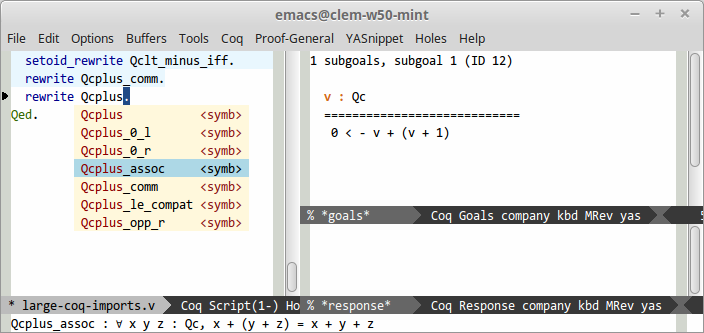

(notice the help string in the mini-buffer)


### Auto-completion of user-defined tactics and tactic notations (w/ patched `coqtop`)

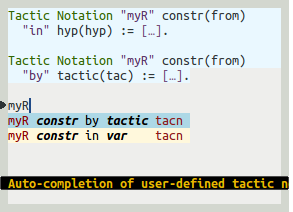

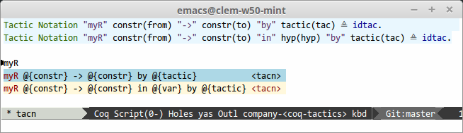

### Source view (with patched `coqtop`)

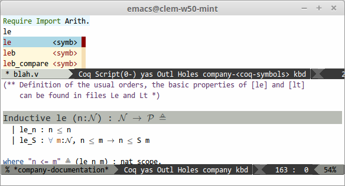


## Troubleshooting

### Empty squares in place of math operators, or incorrect line spacing

If you see blank squares appear where there should be math symbols (`forall`, `exists`, etc.), or if some lines suddenly become very tall, you may be missing a proper math font. See [Installing a math-enabled font](#installing-a-math-enabled-font), or insert the following snippet in your .emacs to disable symbols beautification:

```elisp
;; Disable keyword replacement
(setq company-coq-prettify-symbols nil)
```

Technical note: Proof-General [also offers](http://proofgeneral.inf.ed.ac.uk/htmlshow.php?title=Proof+General+user+manual+%28latest+release%29&file=releases%2FProofGeneral-latest%2Fdoc%2FProofGeneral%2FProofGeneral_5.html#Unicode-Tokens-mode) a Unicode keywords facility. `company-coq`'s implementation is based on the `prettify-symbols-mode` facility found in Emacs 24.4+, yielding a more compact (and faster?) implementation.

## Advanced topics

### Installing a math-enabled font

For font beautification to work properly, you'll need a font with proper symbol support. DejaVu Sans Mono, Symbola, FreeMono, STIX, Unifont, Segoe UI Symbol, Arial Unicode and Cambria Math do. If Emacs doesn't fallback properly, you can use the following snippet:

```elisp
(set-fontset-font t 'unicode (font-spec :name "Symbola") nil 'append)
```

### Registering your own symbols and math operators

Adjust and use the following snippet to register your own keywords. This needs be called before `(company-coq-initialize)`, so the code needs to be added after the code listed above.

```elisp
(add-hook 'coq-mode-hook
          (lambda ()
            (set (make-local-variable 'prettify-symbols-alist)
                 '((":=" . ?≜) ("Proof." . ?∵) ("Qed." . ?■)
                   ("Defined." . ?□) ("Time" . ?⏱) ("Admitted." . ?😱)))))
```

Greek symbols can be obtained using the following mappings:

```elisp
'(("Alpha" . ?Α) ("Beta" . ?Β) ("Gamma" . ?Γ)
  ("Delta" . ?Δ) ("Epsilon" . ?Ε) ("Zeta" . ?Ζ)
  ("Eta" . ?Η) ("Theta" . ?Θ) ("Iota" . ?Ι)
  ("Kappa" . ?Κ) ("Lambda" . ?Λ) ("Mu" . ?Μ)
  ("Nu" . ?Ν) ("Xi" . ?Ξ) ("Omicron" . ?Ο)
  ("Pi" . ?Π) ("Rho" . ?Ρ) ("Sigma" . ?Σ)
  ("Tau" . ?Τ) ("Upsilon" . ?Υ) ("Phi" . ?Φ)
  ("Chi" . ?Χ) ("Psi" . ?Ψ) ("Omega" . ?Ω)
  ("alpha" . ?α) ("beta" . ?β) ("gamma" . ?γ)
  ("delta" . ?δ) ("epsilon" . ?ε) ("zeta" . ?ζ)
  ("eta" . ?η) ("theta" . ?θ) ("iota" . ?ι)
  ("kappa" . ?κ) ("lambda" . ?λ) ("mu" . ?μ)
  ("nu" . ?ν) ("xi" . ?ξ) ("omicron" . ?ο)
  ("pi" . ?π) ("rho" . ?ρ) ("sigma" . ?σ)
  ("tau" . ?τ) ("upsilon" . ?υ) ("phi" . ?φ)
  ("chi" . ?χ) ("psi" . ?ψ) ("omega" . ?ω))
```

in which case you may want to use a custom font for Greek characters:

```
  (set-fontset-font t 'greek (font-spec :name "DejaVu Sans Mono") nil)
```

### Autocompleting symbols and tactics defined externally

The procedure above will give you auto-completion and documentation for tactics, commands, and theorems that you define locally, but not for theorem names and symbols defined in the libraries you load. To get the latter, add the following to your `.emacs`, before `(company-coq-initialize)`:

```elisp
(setq company-coq-dynamic-autocompletion t)
```

This feature won't work unless you build and use a patched coq REPL: see [this fork](https://github.com/cpitclaudel/coq/tree/v8.5-with-cc-patches). One of the relevant patches has been merged upstream; the other two are being discussed [here](https://github.com/coq/coq/pull/64) and [here](https://github.com/coq/coq/pull/56).

### Disabling some modules

Modules, context, symbols, end of block and search results auto-completion can be turned off using the following lines

```elisp
(setq company-coq-autocomplete-modules nil)
(setq company-coq-autocomplete-context nil)
(setq company-coq-autocomplete-symbols nil)
(setq company-coq-autocomplete-block-end nil)
(setq company-coq-autocomplete-search-results nil)
```

You can set these variables using `M-x customize-group RET company-coq RET

### Disabling company-coq

`M-x unload-feature RET company-coq RET` should work fine.

### Installing from source

#### Dependencies

[MELPA](http://melpa.org/#/getting-started)

#### company-coq

```bash
mkdir -p ~/.emacs.d/lisp/
git clone https://github.com/cpitclaudel/company-coq.git ~/.emacs.d/lisp/company-coq
cd ~/.emacs.d/lisp/company-coq
make package && make install
```
