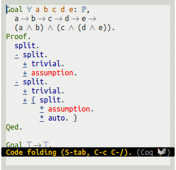
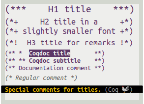
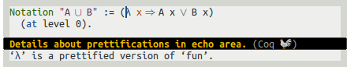

# Company-coq
[](COPYING)
[](http://melpa.org/#/company-coq)
[](http://dx.doi.org/10.5281/zenodo.44331)

A collection of extensions for Proof General's Coq mode.

See [screenshots](#screenshots) below, or jump right to [setup instructions](#setup) and try the tutorial with <kbd>M-x company-coq-tutorial</kbd> after setting up!

## Setup

### Proof General

Download and install Proof General from [GitHub](https://github.com/ProofGeneral/PG):

```bash
git clone https://github.com/ProofGeneral/PG ~/.emacs.d/lisp/PG
cd ~/.emacs.d/lisp/PG
make
```

Then add the following to your `.emacs`:

```elisp
;; Open .v files with Proof General's Coq mode
(load "~/.emacs.d/lisp/PG/generic/proof-site")
```

### MELPA

MELPA is a repository of Emacs packages. Skip this step if you already use [MELPA](http://melpa.org/#/getting-started). Otherwise, add the following to your `.emacs` and restart Emacs:

```elisp
(require 'package)
(add-to-list 'package-archives '("melpa" . "http://melpa.org/packages/") t)
(package-initialize)
```

### Company-Coq

This should be easier: `company-coq` is on [MELPA](http://melpa.org/#/getting-started). Just use <kbd>M-x package-refresh-contents RET</kbd> followed by <kbd>M-x package-install RET company-coq RET</kbd> to install and byte-compile `company-coq` and its dependencies (some of them will produce a few warnings; that's OK).

To enable company-coq automatically, add the following to your `.emacs`:

```elisp
;; Load company-coq when opening Coq files
(add-hook 'coq-mode-hook #'company-coq-mode)
```

Then restart and launch the tutorial with <kbd>M-x company-coq-tutorial</kbd>!

## Screenshots

#### Prettification of operators, types, and subscripts

 

#### Auto-completion

 

 

  

 

#### Snippets and smart commands


#### Outlines, code folding, and jumping to definition





#### Help with errors

 

#### Misc. extensions of Proof General

  

 

## Citing

Use `M-x company-coq-cite` to insert the BibTeX entries for Coq, Proof General, and `company-coq` in the current buffer.

```latex
@InProceedings{CompanyCoq2016,
  Title     = {Company-Coq: Taking Proof General one step closer to a real IDE},
  Author    = {Pit-Claudel, Clément and Courtieu, Pierre},
  Booktitle = {CoqPL'16: The Second International Workshop on Coq for PL},
  Year      = {2016},
  Month     = jan,
  Doi       = {10.5281/zenodo.44331},
  Url       = {http://hdl.handle.net/1721.1/101149}
}
```

## Quick start guide

**You can check out the interactive tutorial by pressing <kbd>M-x company-coq-tutorial RET</kbd>.** See also the **[screenshots](#screenshots)** above!

`company-coq` should be pretty transparent. Completion windows will pop up when `company-coq` has suggestions to make. By default, this would be when you start writing a tactic name or a command. You can also launch manual completion by using <kbd>C-RET</kbd> (or whatever was originally assigned to `proof-script-complete` in Coq mode).

Once auto-completion has started, the following key bindings are available:

* <kbd>RET</kbd> selects a completion
* <kbd>C-g</kbd> interrupts completion.
* <kbd>C-h</kbd> and <kbd>&lt;f1></kbd> display documentation for the currently highlighted keyword, identifier, or tactic.
* <kbd>C-M-v</kbd> scrolls down in the documentation window.
* <kbd>C-w</kbd> opens source view when available (alternatively, pressing <kbd>M-.</kbd> browses to the definition of the identifier at point).

Selecting a completion often inserts a snippet with holes at the current point (`company-coq` uses `yasnippet` as the snippet backend). You can move between holes by using <kbd>&lt;tab></kbd> and <kbd>S-&lt;tab></kbd>.

Loading `company-coq` also binds the following keys:

* <kbd>M-RET</kbd> inserts a new `match` case (`| _ => _`).
* <kbd>M-S-RET</kbd> inserts a new `match goal` rule (`| [ H: _ |- _ ] => _`).
* <kbd>C-c C-a C-x</kbd> extracts the current goal into a separate lemma.
* <kbd>C-down-mouse-1</kbd> (i.e. <kbd>C-click</kbd>) shows an inline quick help box for the identifier under point. The box disappears when the mouse is released. Pressing the <kbd>&lt;menu></kbd> key or <kbd>M-F12</kbd> also works.
* <kbd>M-.</kbd> jumps to the source of the identifier at point, when available.
* <kbd>C-c C-d</kbd> opens the documentation of the identifier at point (for theorems and definitions; for tactics, use <kbd>C-h</kbd> during completion).
* <kbd>C-c C-,</kbd> opens an outline of the code in a separate buffer (using `occur`).
* <kbd>C-c C-/</kbd> folds the current definition, or all definitions in the file if repeated.
* <kbd>C-c C-\\</kbd> unfolds the current definition, or all definitions in the file if repeated.
* <kbd>S-TAB</kbd> folds or unfolds the current bullet or curly-brace-delimited block. With <kbd>C-u</kbd>, <kbd>S-TAB</kbd> folds all bullets and braces in the current buffer.
* <kbd>C-c C-&</kbd> looks up (grep) the current word in files in the current directory's subtree.
* <kbd>C-c C-a C-e</kbd> tries to match the last output to a documented error message, and displays the relevant section of the manual if it finds one.
* <kbd>C-c C-a C-d</kbd> parses the last unification error, and shows a diff of the two types that can't unify. If there is no such error, <kbd>C-c C-a C-d</kbd> shows a diff comparing the last goal to the previous one.

## Tips

* Most completion engines support fuzzy matching: you can type `Require Import C.N..Ab.ZPa` and press <kbd>RET</kbd> to insert `Coq.Numbers.Integer.Abstract.ZParity`, and typing `setrewin` is enough to insert <code>setoid_rewrite <i>term</i> in <i>ident</i></code>. You can (and must) omit spaces: `SLD` will insert `Set Ltac Debug` (of course `SetLtDeb` will also work), and `ULD` will insert `Unset Ltac Debug`.
* Using <kbd>M-S-RET</kbd> to insert new cases in a `match goal` saves a lot of time (and finger contortions). For the match itself, use `mgw` (for `match goal with`).
* The point-and-click feature (quick help) also works in non-graphic mode, if you enable `xterm-mouse-mode`.
* `company-coq` improves on some of Proof General's features. Try <kbd>C-c C-a RET nat RET</kbd>.
* Try right-clicking on a [Require Import] statement.
* Use `a__b` to display `a`<sub>`b`</sub>.

`company-coq` is implemented as a collection of small modules implementing independent features; check out `M-x customize-variable RET company-coq-disabled-features RET` and `M-x customize-group RET company-coq RET` for more info!

## Troubleshooting

### Empty squares in place of math operators, or incorrect line spacing

If you see blank squares appear where there should be math symbols (`forall`, `exists`, etc.), or if some lines suddenly become very tall, you may be missing a proper math font. See [Installing a math font](#installing-a-math-font), or insert the following snippet in your `.emacs` to disable symbols beautification:

```elisp
;; Disable symbol prettification
(setq company-coq-disabled-features '(prettify-symbols))
```

On the other hand, if you like the prettification feature a lot, you can enable it in the terminal:

``` elisp
(setq company-coq-features/prettify-symbols-in-terminals t)
```

Technical note: Proof General [also offers](http://proofgeneral.inf.ed.ac.uk/htmlshow.php?title=Proof+General+user+manual+%28latest+release%29&file=releases%2FProofGeneral-latest%2Fdoc%2FProofGeneral%2FProofGeneral_5.html#Unicode-Tokens-mode) a Unicode keywords facility. `company-coq`'s implementation is based on the `prettify-symbols-mode` facility found in Emacs 24.4+, yielding a more compact (and faster?) implementation.

## Advanced topics

### Installing a math font

For font beautification to work properly, you'll need a font with proper symbol support. [Symbola](http://users.teilar.gr/~g1951d/Symbola.zip), FreeMono, STIX Math, Segoe UI Symbol, Latin Modern, and Cambria Math will all work. If Emacs doesn't fallback properly, you can use the following snippet:

```elisp
(dolist (ft (fontset-list))
  (set-fontset-font ft 'unicode (font-spec :name "YOUR-USUAL-FONT"))
  (set-fontset-font ft 'unicode (font-spec :name "Symbola") nil 'append))
```

#### Fixing math indentation

Using a variable-width font for symbols will break indentation. See [this other project of mine](https://github.com/cpitclaudel/monospacifier#pre-monospacified-fonts-monospace-fonts-with-good-unicode-coverage) to download a monospace-friendly symbols font. You'll want to replace the snippet above by following (adjusting `Symbola` and `DejaVu sans Mono` as appropriate):

```elisp
(dolist (ft (fontset-list))
  (set-fontset-font ft 'unicode (font-spec :name "DejaVu Sans Mono"))
  (set-fontset-font ft 'unicode (font-spec :name "Symbola monospacified for DejaVu Sans Mono") nil 'append))
```

### Folding all goals when a file is opened

Adding the following header to a Coq file will make company-coq hide the bodies of all bullets when the file is opened. You can also customize the `company-coq-initial-state` variable to apply the setting globally.

```coq
(* -*- company-coq-initial-fold-state: bullets; -*- *)
```

### Showing alerts for long-running proofs

If possible, `company-coq` will use the [`alert`](https://github.com/jwiegley/alert) library to display notifications when long-running proofs complete.  `alert` is only needed on Windows and OSX; on Linux systems with DBus this should work out of the box. You can try it out by running the snippet below and opening another application while the proof runs; after 10 seconds company-coq will show a notification.

``` coq
Goal True.
  Fail timeout 10 repeat pose 1.
```

### Registering your own symbols and math operators

#### For a single file

Add the following header to a Coq file, save, and run `M-x revert-buffer` to prettify squiggly arrows.

```coq
(* -*- company-coq-local-symbols: (("<~>" . ?↭) ("~>" . ?↝) ("<~" . ?↜)); -*- *)
```

Alternatively, you can use a special comment at the end of the file:

```coq
(* Local Variables: *)
(* company-coq-local-symbols: (("<~>" . ?↭) ("~>" . ?↝) ("<~" . ?↜)) *)
(* End: *)
```

Tip: you can use `M-x add-file-local-variable` to add this sort of variables.

#### For a single project

Create a `.dir-locals.el` file at the root of your project, and add following contents to it:

```elisp
;;; Directory Local Variables
;;; For more information see (info "(emacs) Directory Variables")

((coq-mode
  (company-coq-dir-local-symbols
   (("<~>" . ?↭) ("~>" . ?↝) ("<~" . ?↜)))))
```

Tip: you can use `M-x add-dir-local-variable` to add this sort of variables.

#### For all Coq files

Adjust and use the following snippet to register your own prettifications for all Coq files. This must run before `(company-coq-mode)`, so it must be added after the `company-coq` setup code above.

```elisp
(add-hook 'coq-mode-hook
          (lambda ()
            (setq-local prettify-symbols-alist
                        '((":=" . ?≜) ("Proof." . ?∵) ("Qed." . ?■)
                          ("Defined." . ?□) ("Time" . ?⏱) ("Admitted." . ?😱)))))
```

Greek symbols can be obtained using the following mappings:

```elisp
'(("Alpha" . ?Α) ("Beta" . ?Β) ("Gamma" . ?Γ)
  ("Delta" . ?Δ) ("Epsilon" . ?Ε) ("Zeta" . ?Ζ)
  ("Eta" . ?Η) ("Theta" . ?Θ) ("Iota" . ?Ι)
  ("Kappa" . ?Κ) ("Lambda" . ?Λ) ("Mu" . ?Μ)
  ("Nu" . ?Ν) ("Xi" . ?Ξ) ("Omicron" . ?Ο)
  ("Pi" . ?Π) ("Rho" . ?Ρ) ("Sigma" . ?Σ)
  ("Tau" . ?Τ) ("Upsilon" . ?Υ) ("Phi" . ?Φ)
  ("Chi" . ?Χ) ("Psi" . ?Ψ) ("Omega" . ?Ω)
  ("alpha" . ?α) ("beta" . ?β) ("gamma" . ?γ)
  ("delta" . ?δ) ("epsilon" . ?ε) ("zeta" . ?ζ)
  ("eta" . ?η) ("theta" . ?θ) ("iota" . ?ι)
  ("kappa" . ?κ) ("lambda" . ?λ) ("mu" . ?μ)
  ("nu" . ?ν) ("xi" . ?ξ) ("omicron" . ?ο)
  ("pi" . ?π) ("rho" . ?ρ) ("sigma" . ?σ)
  ("tau" . ?τ) ("upsilon" . ?υ) ("phi" . ?φ)
  ("chi" . ?χ) ("psi" . ?ψ) ("omega" . ?ω))
```

in which case you may want to use a custom font for Greek characters:

```
(dolist (ft (fontset-list))
  (set-fontset-font ft 'greek (font-spec :name "DejaVu Sans Mono")))
```

### Autocompleting symbols and tactics defined externally

The procedure above will give you auto-completion and documentation for tactics, commands, and theorems that you define locally, but not for theorem names and symbols defined in the libraries you load. To get the latter, add the following to your `.emacs`, before `(company-coq-mode)`:

```elisp
(setq company-coq-live-on-the-edge t)
```

This feature won't work unless you build and use a patched coq REPL: see [this fork](https://github.com/cpitclaudel/coq/tree/v8.5-with-cc-patches). Two of the relevant patches has been merged upstream (into Coq trunk, not 8.5); the last one is being discussed [here](https://github.com/coq/coq/pull/64).

You can download these changes as patches for [8.4](etc/8.4-additions.patch), [8.5](etc/8.5-additions.patch) or [trunk](etc/trunk-additions.patch).

To find everything on 8.4 you'll need this extra bit:

```elisp
(setq company-coq-extra-symbols-cmd "SearchAbout -\"____\"")
```

### Installing from source

Use Cask.

### Special thanks

Many thanks to Pierre Courtieu for his work on Proof General, and to Jonathan Leivent and Jason Gross for their tireless bug reports and suggestions!
