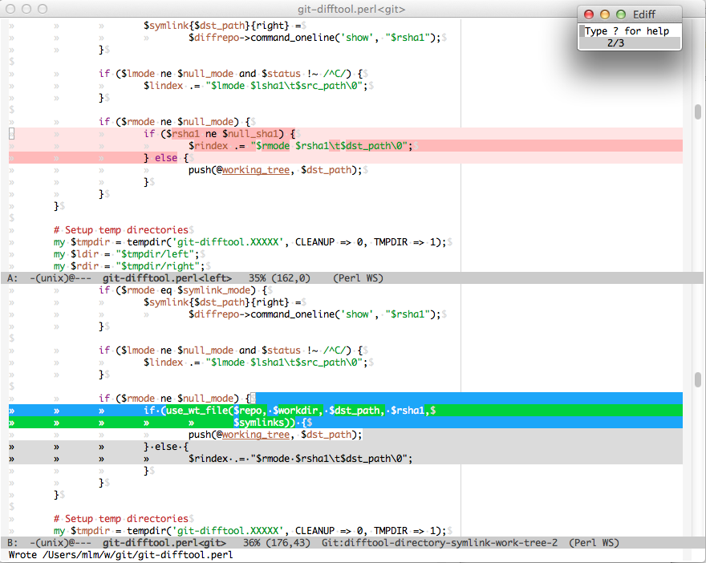

# dircmp-mode: Emacs directory comparison and sync mode

## Installation and usage

Add to your Emacs startup file:

    (require 'dircmp)

Then:

    M-x compare-directories RET dir1 RET dir2 RET

## Use dircmp-mode as your Git difftool

There's a [change cooking in `git difftool`][change-in-git-difftool]
that will make diff tools with editing capabilities much more powerful.
The change will make `git difftool` use symbolic links to working tree
files whenever one side of the comparison is the working tree.

[change-in-git-difftool]: http://thread.gmane.org/gmane.comp.version-control.git/217979/focus=218164

Current versions of [`git difftool`][git-difftool] can use working tree
symlinks, but only for files with uncommitted changes. Otherwise, it
creates temporary copies of the files, making it cumbersome to save
edits made during the comparison.

[git-difftool]: http://git-scm.com/docs/git-difftool

Emacs [dircmp-mode follows symbolic links] and compares the destination
file content, allowing Emacs, together with the `git difftool` change,
to edit working tree files during comparison.

[dircmp-mode now follows symbolic links]: https://github.com/matthewlmcclure/dircmp-mode/compare/c9e613832289a12320b7bf9fd99e3ed8abf7b012...33def34d89f63551eb7166fba71ddb57aa6ba882

For example, review changes that your topic branch would merge to your
master branch:

    $ git difftool -d $(git merge-base master HEAD)

Make changes, and save them from Ediff:

Emacs writes the changes directly to your working tree:

    $ git diff
    diff --git a/git-difftool.perl b/git-difftool.perl
    index 5f093ae..7cf61cf 100755
    --- a/git-difftool.perl
    +++ b/git-difftool.perl
    @@ -174,7 +174,8 @@ EOF
     		}
     
     		if ($rmode ne $null_mode) {
    -			if (use_wt_file($repo, $workdir, $dst_path, $rsha1, $symlinks)) {
    +			if (use_wt_file($repo, $workdir, $dst_path, $rsha1,
    +					$symlinks)) {
     				push(@working_tree, $dst_path);
     			} else {
     				$rindex .= "$rmode $rsha1\t$dst_path\0";

***

To configure [dircmp-mode] as your Git diff tool:

[dircmp-mode]: https://github.com/matthewlmcclure/dircmp-mode

`~/.gitconfig`:

    ...
    [difftool "emacs"]
      cmd = /path/to/dircmp/emacs-git-difftool.sh \"$LOCAL\" \"$REMOTE\"
      prompt = false

    [diff]
        tool = emacs
    ...

***

Thanks to [John Keeping], [Junio C. Hamano], and [David Aguilar] for
implementing and reviewing the `git difftool` changes to make this
possible.

[John Keeping]: https://github.com/johnkeeping
[Junio C. Hamano]: https://plus.google.com/108182106411180467879
[David Aguilar]: https://plus.google.com/117558135061629280133
