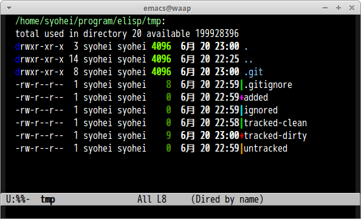
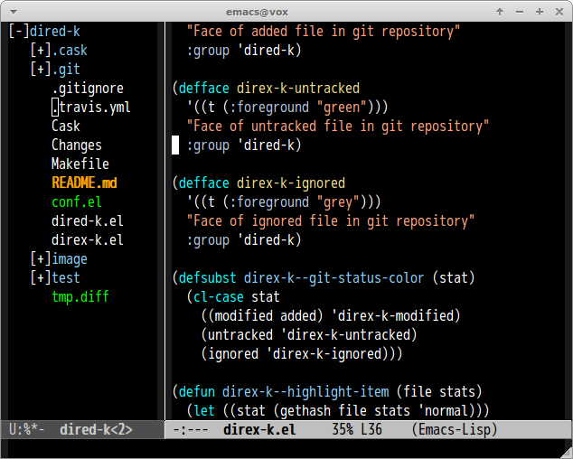

# dired-k.el [![travis badge][travis-badge]][travis-link] [![melpa badge][melpa-badge]][melpa-link] [![melpa stable badge][melpa-stable-badge]][melpa-stable-link]

`dired-k.el` highlights dired buffer like [k](https://github.com/supercrabtree/k).

(This may works only default dired setting)


## screenshot

### k.zsh style



### git status --short style


### direx version




## Installation

`dired-k` is available on [MELPA](https://melpa.org/) and [MELPA stable](https://stable.melpa.org/)

You can install `dired-k` with the following command.

<kbd>M-x package-install [RET] dired-k [RET]</kbd>


## Commands

### `dired-k`

Highlight dired buffer by following parameters.

- File size
- Modified time
- Git status(if here is in git repository)

### `dired-k-no-revert`

Same as `dired-k`, except this command does not call `revert-buffert`.
This command can set to a hook `dired-after-readin-hook`.


## Customization

### `dired-k-style`(Default `nil`)

View like `k.zsh` if this value is `nil`. View like `git status --short` if
this value is `'git`.

### `dired-k-human-readable`(Default `nil`)

Set non-nil if you add `-h` or `--human-readable` option to `dired-listing-switches`.

### `dired-k-padding`(Default 0)

Number of spaces around git status character.


## Sample Configuration

### dired-k
```lisp
(require 'dired-k)
(define-key dired-mode-map (kbd "K") 'dired-k)

;; You can use dired-k alternative to revert-buffer
(define-key dired-mode-map (kbd "g") 'dired-k)

;; always execute dired-k when dired buffer is opened
(add-hook 'dired-initial-position-hook 'dired-k)

(add-hook 'dired-after-readin-hook #'dired-k-no-revert)
```

### direx-k
```lisp
(require 'direx-k)

(global-set-key (kbd "C-\\") 'direx-project:jump-to-project-root-other-window)
(define-key direx:direx-mode-map (kbd "K") 'direx-k)
```

[travis-badge]: https://travis-ci.org/syohex/emacs-dired-k.svg
[travis-link]: https://travis-ci.org/syohex/emacs-dired-k
[melpa-link]: https://melpa.org/#/dired-k
[melpa-stable-link]: https://stable.melpa.org/#/dired-k
[melpa-badge]: https://melpa.org/packages/dired-k-badge.svg
[melpa-stable-badge]: https://stable.melpa.org/packages/dired-k-badge.svg
