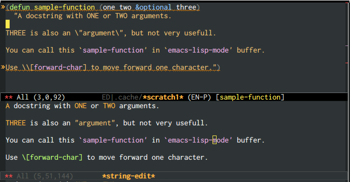

# elisp-docstring-mode

A simple major-mode for editing content of Emacs Lisp docstrings.  Very useful in combination with [string-edit](https://github.com/magnars/string-edit.el).

# Features

Provides font-lock.  In combination with string-edit, there is support for automatic escaping and unescaping of quotes.

Here is a comparison of the string as a docstring in `emacs-lisp-mode` and as a string in a `string-edit` buffer (with `elisp-docstring-mode` enabled).

