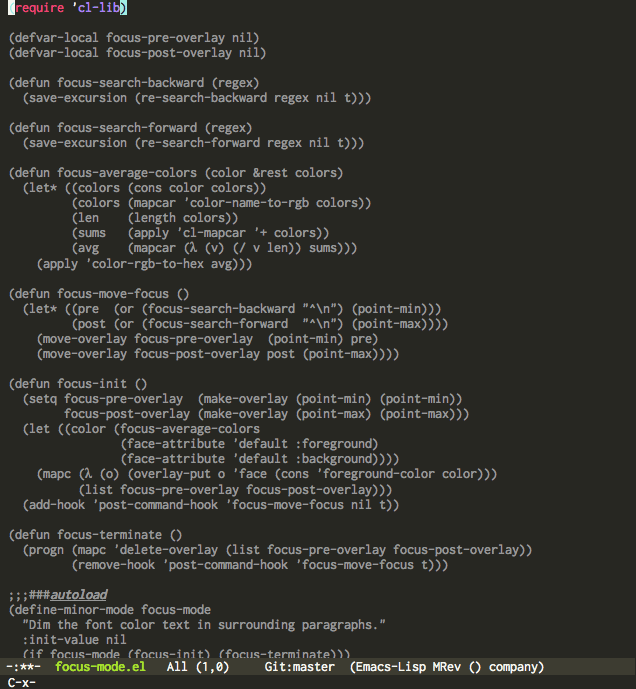

# Focus

Focus provides `focus-mode` that dims the text of surrounding sections, similar to [iA Writer's](https://ia.net/writer) Focus Mode.

## Installation

You can install Focus using elpa. It's available on [melpa](http://melpa.milkbox.net/):

<kbd> M-x package-install focus </kbd>

The package has only been tried on Emacs 24.4 and 24.5, but should work on Emacs 24 or higher.

## Usage

Enable the `focus-mode` with <kbd> M-x focus-mode </kbd>.

Also, `focus-read-only-mode` is provided, which is a mode optimized for continuous reading. It inhibits change in the buffer, hides the cursor and provides bindings for moving between *things* (defined in [Thing At Point](http://emacswiki.org/emacs/ThingAtPoint)). One can toggle `focus-read-only-mode` with <kbd> M-x focus-read-only-mode </kbd> or <kbd> C-c C-q </kbd> if `focus-mode` is enabled.

Some bindings for simple navigation and exiting `focus-read-only-mode` are provided.

Keybinding         | Description
-------------------|----------------------------
<kbd> n </kbd>     | Jump to next *thing*
<kbd> SPC </kbd>   | Jump to next *thing*
<kbd> p </kbd>     | Jump to previous *thing*
<kbd> S-SPC </kbd> | Jump to previous *thing*
<kbd> i </kbd>     | Exit `focus-read-only-mode`
<kbd> q </kbd>     | Exit `focus-read-only-mode`

## Configuring

The amount of dimness can be customized by setting the `focus-dimness` variable, where a positive integer indicates a more dim color (i.e. more blended with the background color of your theme), and a negative integer indicates a less dim color.

Focus uses the [Thing At Point](http://emacswiki.org/emacs/ThingAtPoint) library to choose what section should be in focus. By default, modes derived from `prog-mode` uses `defun`, and modes derived from `text-mode` uses `sentence`. This a customizable by setting the `focus-mode-to-thing` variable, which is a list containing pairs on the form `(mode . thing)`.

### Example

This is what it looks like:

Light Theme (leuven)                     |  Dark Theme (monokai)
:---------------------------------------:|:---------------------------------------:
 | 
