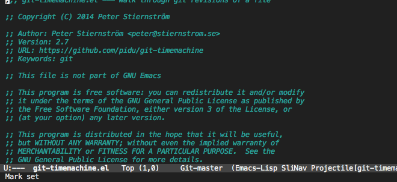

# Git time machine

## Installation

Installation alternatives:

- Download git-timemachine.el and drop it somewhere in your `load-path`.
- If you use `el-get`, simply add `git-timemachine` to your packages list.
- If you have melpa configured it's available through `package-install`.

## Usage

Visit a git-controlled file and issue `M-x git-timemachine` (or bind
it to a keybinding of your choice). If you just need to toggle the
time machine you can use `M-x git-timemachine-toggle`.

Use the following keys to navigate historic version of the file
 - `p` Visit previous historic version
 - `n` Visit next historic version
 - `w` Copy the abbreviated hash of the current historic version
 - `W` Copy the full hash of the current historic version
 - `g` Goto nth revision
 - `q` Exit the time machine.
 - `b` Run `magit-blame` on the currently visited revision (if magit available).

## Customize

Set `git-timemachine-abbreviation-length` (default 12) to your
preferred length for abbreviated commit hashes.

Set `git-timemachine-show-minibuffer-details` (default t) to control
whether details of the commit are shown in the minibuffer.

Also `M-x customize [git-timemachine]`.
