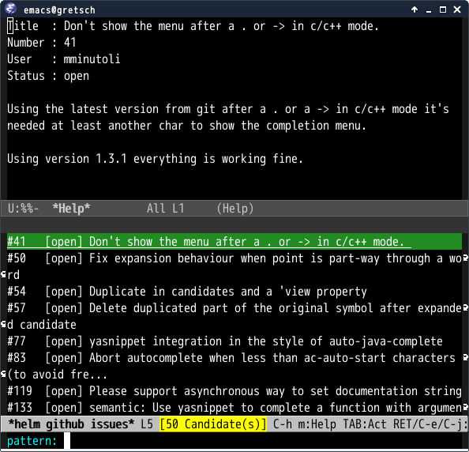

# helm-github-issues.el

`helm-github-issues.el` provides viewer of github issues with helm-interface.


## Screenshot




## Customize

`helm-github-issues-bookmarks` stands for bookmarks of github repositories.
You can complete them when input repository. A example is as below.

````elisp
(setq helm-github-issues-bookmarks
      '("syohex/emacs-git-gutter" "auto-complete/auto-complete"))
````

## Action

I have implemented only browse url.
