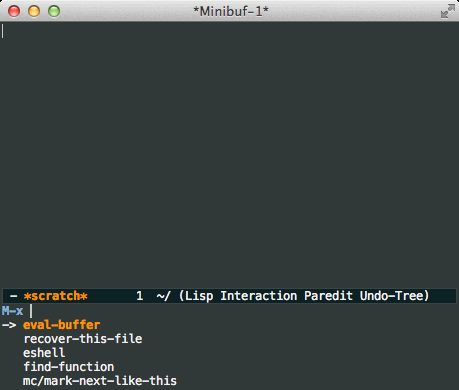

# ido-vertical-mode.el

[](https://travis-ci.org/gempesaw/ido-vertical-mode.el) Makes ido-mode display vertically.



This mode takes care of some caveats that are otherwise ugly to store
in your init file.

You may also be interested in
[`ido-ubiquitous`](https://github.com/DarwinAwardWinner/ido-ubiquitous)
and [`smex`](https://github.com/nonsequitur/smex).

## Install via [MELPA Stable](http://stable.melpa.org/#/) or [marmalade](http://marmalade-repo.org)

`M-x` `package-install` `ido-vertical-mode`

If you use MELPA instead of MELPA Stable, there's no guarantee that
you'll get something that works; I've accidentally broken master
before and will unfortunately probably do it again :(

## Turn it on

    (require 'ido-vertical-mode)
    (ido-mode 1)
    (ido-vertical-mode 1)

Or you can use `M-x ido-vertical-mode` to toggle it.

## Customize

#### Count

Show the count of candidates:

```elisp
(setq ido-vertical-show-count t)
```

#### Colors

Make it look like @abo-abo's [blog post](http://oremacs.com/2015/02/09/ido-vertical/):

```elisp
(setq ido-use-faces t)
(set-face-attribute 'ido-vertical-first-match-face nil
                    :background "#e5b7c0")
(set-face-attribute 'ido-vertical-only-match-face nil
                    :background "#e52b50"
                    :foreground "white")
(set-face-attribute 'ido-vertical-match-face nil
                    :foreground "#b00000")
(ido-vertical-mode 1)
```

Make it look like the screenshot above:

```elisp
(setq ido-use-faces t)
(set-face-attribute 'ido-vertical-first-match-face nil
                    :background nil
                    :foreground "orange")
(set-face-attribute 'ido-vertical-only-match-face nil
                    :background nil
                    :foreground nil)
(set-face-attribute 'ido-vertical-match-face nil
                    :foreground nil)
(ido-vertical-mode 1)
```

Reset the faces to their defaults:

```elisp
(set-face-attribute 'ido-vertical-first-match-face nil
                    :background nil
                    :foreground nil)
(set-face-attribute 'ido-vertical-only-match-face nil
                    :background nil
                    :foreground nil)
(set-face-attribute 'ido-vertical-match-face nil
                    :background nil
                    :foreground nil)
(ido-vertical-mode 1)

;; optionally
(setq ido-use-faces nil)
```

#### Keybindings

Since the prospects are listed vertically, it makes sense to use
`C-n/C-p` to navigate through the options. These are added to the
`ido-completion-map` by default (and `ido-toggle-prefix`, previously
on `C-p`, is moved to `M-p`).

You also have the option to rebind some or all of the arrow keys with
`ido-vertical-define-keys`:

    (setq ido-vertical-define-keys 'C-n-C-p-up-and-down)

to use up and down to navigate the options, or

    (setq ido-vertical-define-keys 'C-n-C-p-up-down-left-right)

to use left and right to move through the history/directories.
