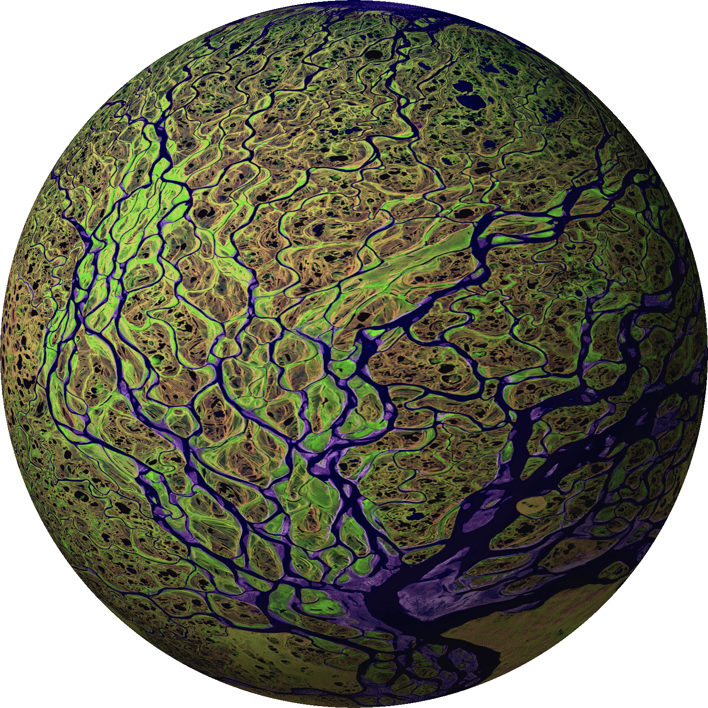

Lentic allows two buffers to share the same or similar content but
otherwise operate independently. This can be used for several different
purposes. Different buffers can be in the same mode, with different locations
of point, even different text sizes -- in effect, providing multiple
persistent views.

It is also possible to have the different lentic buffers in different modes,
giving a form of multi-modal editing. Switching buffers effectively switches
modes as well.

While the content of two lentic buffers must be related, it does not need to
be syntactically identical. This allows it to be used for a form of literate
programming -- for example, one buffer may contain valid LaTeX source with
blocks of Lisp, while in the other the LaTeX source is commented out, giving
an entirely valid Lisp file. The lentic documentation is self-hosting -- the
source code contains all of the documentation written in Org-mode. It can be
generated and viewed using the menu items (Edit->Lentic->Read Doc), or it can
be viewed at
http://homepages.cs.ncl.ac.uk/phillip.lord/lentic/lenticular.html. Getting
Started documentation is [available](lenticular.org#getting-started).

As well as the core library, this package also contains various syntactic
transformations, and a minor-mode for manipulating lentic buffers from a user
perspective.

Previously, lentic was known as linked-buffer.

## In Action

It is fairly hard to explain what lentic does and much easier to show in
pictures. I am indebted to [tumashu](https://github.com/tumashu) for producing
these excellent gifs, showing lentic in action combined with some advanced use
of org-mode, web publishing and Chinese input methods.

There are also some videos of mine showing lentic over
[emacs source](https://vimeo.com/116078853) and as part of a
[latex workflow](https://vimeo.com/116141808).

## Contributions

I welcome contributions to lentic. I would like to contribute lentic to ELPA
or the Emacs core in the future, so would prefer that contributors has
completed the relevant paperwork with the FSF.

## ChangeLog

### 0.12

This release adds significant support for use of lentic "out-of-the-box" with
several languages when written as scripts, including where those scripts use a
"magic cookie" line at the beginning.

### 0.11

This release is largely a bug fix release, with a single new feature. A new
menu item has been added to force cloning, which can be useful with
lentic-chunk which can fallback to an identical clone, and can need a full
clone to restore the two buffers.

The buffer-list-update-hook was very expensive, so handling has been improved.
Finally, unmatched config was incorrectly returning the wrong type from
lentic-invert. Finally, the f.el is now properly required.

### 0.10

This release is largely a bug fix release, including a missing require, handling
of delimiters in strings, and more consistent widening.

This also includes one significant breaking change, which is that
"lentic-block" has been renamed "lentic-chunk". The latter is more consistent
with other peoples usage (polymode for instance), but also because "block" is
better used in the context of block vs line comments.

### 0.9

This release introduces one new feature: unmatched-block buffers. These are
forms of buffer where the start and end of blocks are not matched. They have
been introduced mainly to support org-mode files which can support multiple
embedded source languages, all of which share the same close tag.

### 0.8

This release introduces two new features. First, it is now possible to have
multiple lentic buffers. This is important because lentic has more than one
use -- both for maintaining two syntactic views (for example for literate
programming) and for maintaining two identical persistent views (for example,
for editing a file in two places at once). It's now possible to do both of
these at the same time. Specific support has been added for views in
lentic-mode. This necessitates a change to the return value of lentic-clone to
enable the percolation of changes between several buffers. In this default
usage of two lentic buffers this will have no effect.

Second, the documentation system introduced in 0.7 has been made generic and
can be used to generate and display documentation for any package which
supports it. The m-buffer package (which is a dependency) is an example of
this.

#### New Features

- Multiple lentic buffers are now possible.
- Features to create new views.
- Documentation is now entirely self-hosting.
- Substantial rework of major-mode
- Haskell support
- Rot13 support (as an example!)

#### Known Issues

- Lentic now crashes with backtraces in batch, rather than using the
  error handling intended for interactive use.
- Cleaner handling of invalidity for lentic-block.
- The location of point in a view can jump unexpectedly after some commands
  (such as `fill-paragraph').

#### Breaking Changes

- The return value of lentic-clone has now changed.

### 0.7

#### New Features

- haskell->latex support added
- Full Documentation System added
- Lentic buffers can be auto-killed now
- Rot13 added after many requests
- Mode lighter now shows when a lentic buffer exists.
- lentic-block shows invalid states in the mode-line

#### Breaking Changes

lentic-start-mode has now gone, and been combined with lentic-mode. A new
global-lentic-mode has been introduced which you should use instead.

#### Bug Fix

- "swap" menu item now functional
- lentic-mode actually does something now.

### 0.6.1

#### Bug Fix

- documentation updates for autoload error
- lentic-mode.el now requires lentic.el

### 0.6

The main feature of this release is that changes percolation now happens
incrementally, so only those parts of the buffer are updated. As a result,
lentic now cope with long files with little noticable delay.

The files in the package have been re-organised. All the user interaction code
is now in lentic-mode.el, meaning that lentic can be used as a library if
required. Development code is now in lentic-dev.el.

This package has now been renamed from linked-buffer to lentic.

Finally, the documentation in this package is now self-hosting, using orgel
comments. See lentic-org.el for further details.

### 0.5

#### Features
- org to emacs-lisp support
- Asciidoc support for lisp
- More Tests added
- Full testing framework implemented

#### Bug Fix

- pabbrev handling was broken

### 0.4

Some bug fixes and asciidoc->clojure support added.

### 0.3

This release is mainly a bug fix of 0.2, but also includes support for delayed
cloning.

#### Features

First addition of linked-buffer-delayed.el enabling buffer cloning in the idle
thread.

#### Bug Fixes

A typo in linked-buffer-block.el prevented it from working. This has now been fixed.

### 0.2

The configuration system has been totally written using EIEIO objects
which should scale better into the future.
