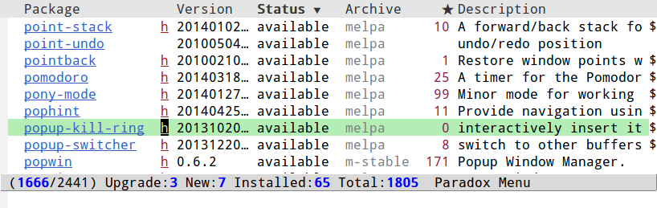
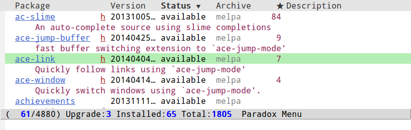

Paradox
=======

[](http://travis-ci.org/Malabarba/paradox)
[](http://melpa.org/#/paradox)
[](http://melpa.org/#/paradox)
[](https://coveralls.io/r/Malabarba/paradox)
[](http://www.gnu.org/licenses/gpl-3.0.html)

[](https://gratipay.com/endless-parentheses)

Project for modernizing Emacs' Package Menu. With improved appearance,
mode-line information. Github integration, customizability,
asynchronous upgrading, and more.

Here are some visual comparisons:

#### Regular Package Menu ####


#### Paradox ####


#### Paradox (multi-line) ####
  
*These screenshots use smart-mode-line, but a similar effect is obtained with the regular mode-line.*

Usage
===

Paradox can be installed from Melpa with

    M-x package-install RET paradox

It can also be installed manually in the usual way, just be mindful of
the dependencies.

To use it, simply call `M-x paradox-list-packages` (instead of the
regular `list-packages`).
This will give you most features out of the box. If you want to be
able to star packages as well, just configure the
`paradox-github-token` variable then call `paradox-list-packages`
again.

If you'd like to stop using Paradox, you may call `paradox-disable`
(or just restart Emacs) and go back to using the regular
`list-packages`.

### Use Paradox as the Default Interface
In order to use the Paradox interface by default (and just having to
call the standard `list-packages` command), add the following in your
init file:

```Emacs Lisp
(require 'paradox)
(paradox-enable)
```

## Current Features ##

### Several Improvements ###

Paradox implements many small improvements to the package menu
itself. They all work out of the box and are completely customizable!
*(Also, hit `h` to see all keys.)*

* Visit the package's homepage with `v` (or just use the provided buttons).
* View a list of recent commits with `l`.
* Use `paradox-require` instead of `require` to automatically install
  absent packages.
* Shortcuts for package filtering:
    * `f r` filters by regexp.
    * `f u` display only packages with upgrades.
    * `f k` filters by keyword (emacs 24.4 only).
    * `f s` filters by user starred packages.

And some more...
* `hl-line-mode` enabled by default.
* Display useful information on the mode-line and cleanup a bunch of
  useless stuff.
* **Customization!** Just call `M-x paradox-customize` to see what you can
  do.
    * Customize column widths.
    * Customize faces (`paradox-star-face`,
      `paradox-status-face-alist` and `paradox-archive-face`).
    * Customize local variables.


### Execution Hook ###

Paradox defines a hook called `paradox-after-execute-functions`. Functions
added to this hook are run whenever packages are installed, deleted,
or upgraded. This is used to implement part of the Paradox
functionality, which makes it very easy to customize and extend.

- A full report is available at the *\*Paradox Report\** buffer. You
  can disable this feature with:

        (remove-hook 'paradox--report-buffer-print 'paradox-after-execute-functions)

- If the upgrade was performed without querying the user (which
  happens when `paradox-execute` is called with a prefix argument),
  then the report buffer is displayed at the end.
  You can disable this feature with:

        (remove-hook 'paradox--report-buffer-display-if-noquery 'paradox-after-execute-functions)

- A message is printed in the echo area with a brief summary of the
  transaction. You can disable this feature with:

        (remove-hook 'paradox--report-message 'paradox-after-execute-functions)

### Package Ratings ###

Paradox also integrates with
**GitHub Stars**, which works as **rough** package rating system.
That is, Paradox package menu will:

1. Display the number of GitHub Stars each package has (assuming it's
   in a github repo, of course);
2. Possibly automatically star packages you install, and unstar
   packages you delete (you will be asked the first time whether you
   want this);
3. Let you star and unstar packages by hitting the `s` key;
4. Let you star all packages you have installed with `M-x paradox-star-all-installed-packages`.

Item **1.** will work out of the box, the other items obviously
require a github account (Paradox will help you generate a token the
first time you call `paradox-list-packages`).

## Known Bugs ##

* On some cases there's an annoying gnutls error message after downloading the star counts `gnutls.c: [0] (Emacs) fatal error: The TLS connection was non-properly terminated.`.
  If anyone knows how to fix it, I'm all ears.

## How Star Displaying Works ##

We generate a map of `Package Name -> Repository` from
[Melpa](https://github.com/milkypostman/melpa.git)'s `recipe`
directory, some repos may correspond to more than one package.
This map is used count the stars a given package has.
_This doesn't mean you need Melpa to see the star counts, the numbers
will be displayed regardless of what archives you use._

Currently, packages that are not hosted on GitHub are listed with a
blank star count, which is clearly different from 0-star packages
(which are displayed with a 0, obviously).
If you know of an alternative that could be used for these packages,
[open an issue](https://github.com/Malabarba/paradox/issues/new)
here, I'd love to hear.
