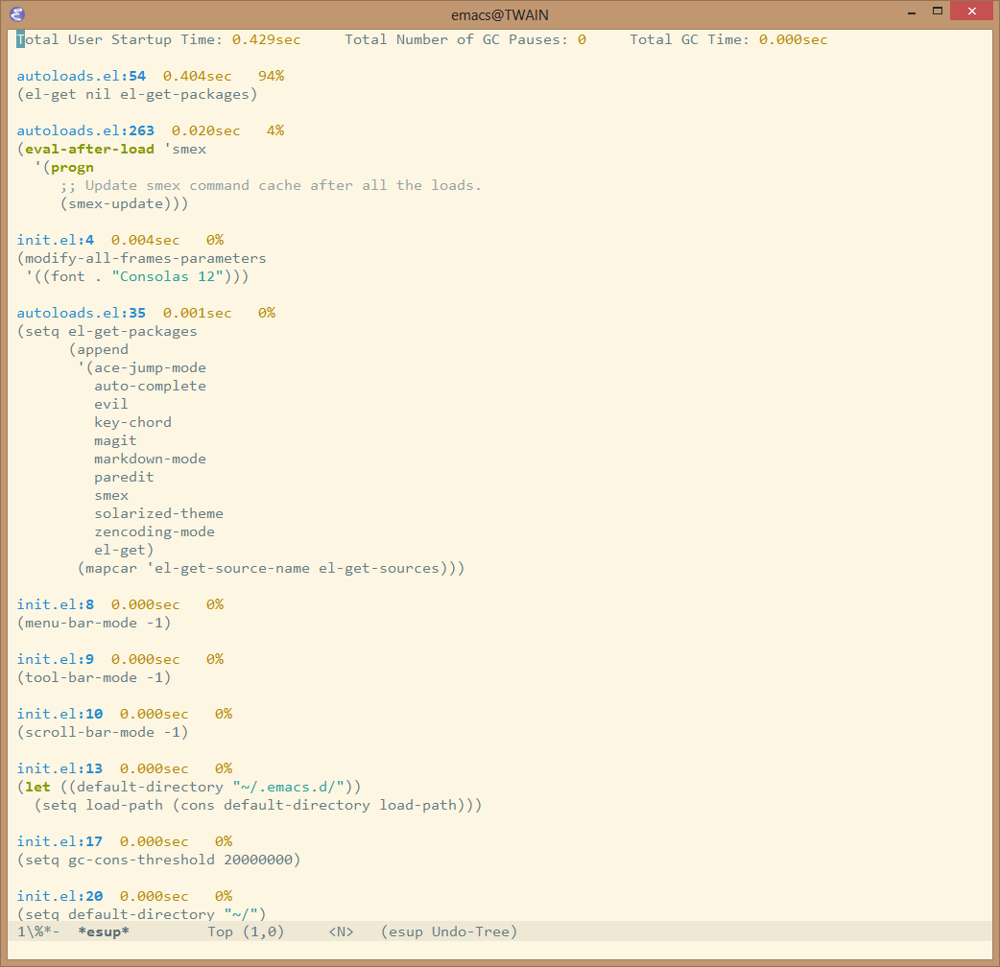

[](https://travis-ci.org/jschaf/esup) [](http://melpa.org/#/esup)


ESUP - Emacs Start Up Profiler
==============================

Benchmark Emacs Startup time without ever leaving your Emacs.



Installation
============

**With MELPA**

First, add the package repository:

```lisp
(add-to-list 'package-archives
             '("melpa" . "http://melpa.milkbox.net/packages/") t)
```

Then install esup:

<kbd>M-x package-install RET esup RET</kbd>

**El-Get**

`esup` is included in the El-Get repository

Install esup:

<kbd>M-x el-get-install RET esup RET</kbd>

**Manually**

Download `esup.el` and place the download directory on your
`load-path` like so:

```lisp
(add-to-list 'load-path "~/.emacs.d/path/to/esup")
(autoload 'esup "esup" "Emacs Start Up Profiler." nil)
```

Usage
=====

To start Esup, run <kbd>M-x esup</kbd>, and watch the magic happen.
