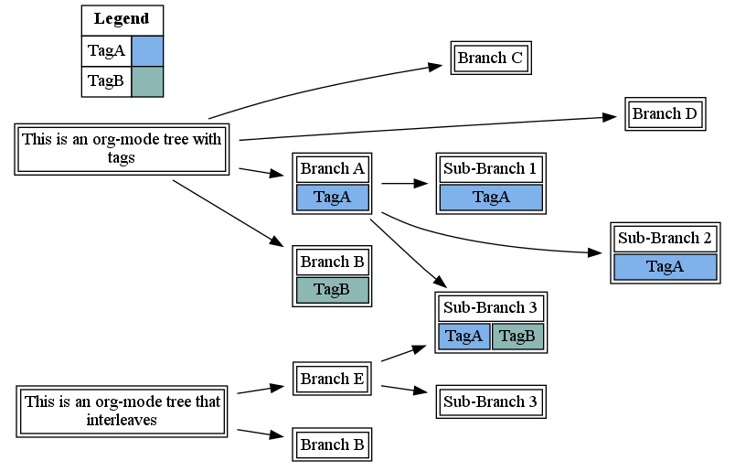
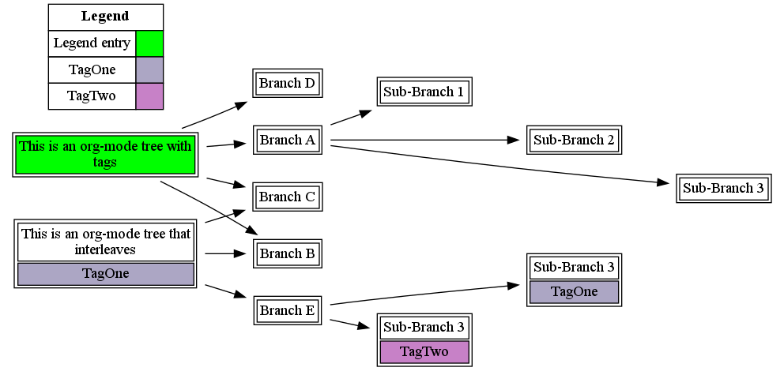
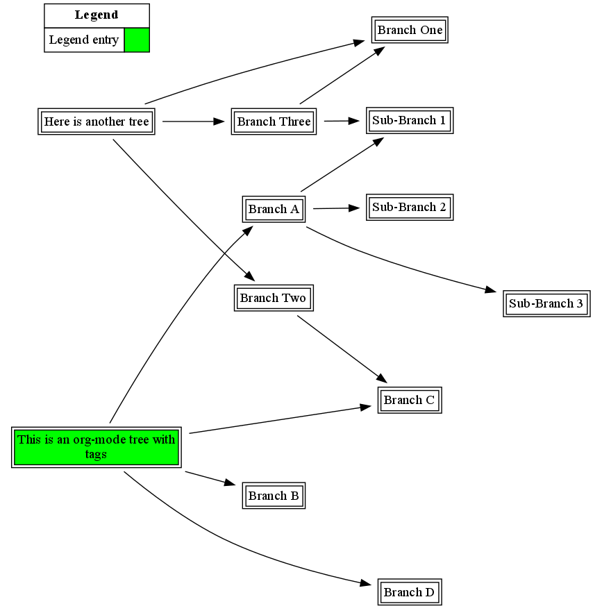

# org-mind-map
This is an emacs package that creates graphviz directed graphs from org-mode files.

# Requirements

This package relies on the [Graphviz](http://graphviz.org/) suite of graphical diagramming tools. 
## windows 
(the default option), these tools are available via [cygwin](http://cygwin.com/). 
## linux 
these tools are available through any of the popular package managers.
## mac
binarys are at the graphviz site, but for recent versions like El Capitan, Sierra and High Sierra, macports or
homebrew are recommended.

```bash
brew install graphviz
```

This package also relies on the org-mode and dash libraries, available from melpa (M-x list-packages).

# Installation and usage

To install, add this code to your .emacs:

```elisp
(load "INSTALLPATH/org-mind-map.el")
```

Then, run `M-x org-mind-map-write` within the org-mode file you would like to make a mind-map for. If all works as expected, a PDF file will be generated in the same directory as the org file.

# Examples

## Basic concept

Here is an example org-mode tree that demonstrates the basic concept:

```Org
* This is an example org-mode tree
The content of the node doesn't matter.
** Branch A
*** Sub-Branch 1
*** Sub-Branch 2
*** Sub-Branch 3
** Branch B
** Branch C
** Branch D
```

and the result is shown below:


## Tags

You can also add tags, as in this org-mode file:

```Org
* This is an org-mode tree with tags
** Branch A :TagA:
*** Sub-Branch 1 :TagA:
*** Sub-Branch 2 :TagA:
*** Sub-Branch 3 :TagA:TagB:
** Branch B :TagB:
** Branch C
** Branch D
```

These are randomly color-coded into pastel tags:


## Interleaving Graphs

Finally, by naming headlines across your org-mode file, as shown below, you can interleave trees.

```Org
* This is an org-mode tree with tags
** Branch A :TagA:
*** Sub-Branch 1 :TagA:
*** Sub-Branch 2 :TagA:
*** Sub-Branch 3 :TagA:TagB:
** Branch B :TagB:
** Branch C
** Branch D
* This is an org-mode tree that interleaves
** Branch E
*** Sub-Branch 3
*** Sub-Branch 3 :TagA:TagB:
** Branch B
```


 this results in this file:



Note that the interleaving is done based on the exact text of the headline, so these have to exactly match (including tags).


## Selective Colors
   If you would like a node to show up as a specific color, you can add the `:OMM-COLOR:` and `:OMM-LEGEND:` properties to a node. The node will be colored in, and a legend entry item will be added, as shown below:

```Org
* This is an org-mode tree with tags
:PROPERTIES:
:OMM-COLOR: GREEN
:OMM-LEGEND: Legend entry
:END:

** Branch A 
*** Sub-Branch 1 
*** Sub-Branch 2 
*** Sub-Branch 3 

** Branch B


** Branch C 
** Branch D 
* This is an org-mode tree that interleaves :TagOne:
** Branch E
*** Sub-Branch 3 :TagTwo:

*** Sub-Branch 3 :TagOne:
** Branch B
** Branch C
```

 this results in this file:



## Links
   You can also draw edges between nodes by including links to headlines in your Org mode files. Links will be drawn from the parent heading to  the heading of the destination link. This works as shown below:

```Org
* This is an org-mode tree with tags
:PROPERTIES:
:OMM-COLOR: GREEN
:OMM-LEGEND: Legend entry
:END:

** Branch A 
*** Sub-Branch 1 
*** Sub-Branch 2 
*** Sub-Branch 3 

** Branch B


** Branch C 
** Branch D 
* Here is another tree
** Branch One
** Branch Two
   [[Branch C]]
** Branch Three

   [[Branch One][Another link]]

   [[Sub-Branch 1][Yet Another Link]]
```

 this results in this file:




# Thanks!

http://pages.sachachua.com/evil-plans/

# Other Options

Customize the `org-mind-map-engine` variable to specify additional layout options (e.g. radial layouts where root nodes are in the center of the graph), and customize `org-mind-map-rankdir` to specify if the chart is going up-and-down or left-to-right.

## Selective Export
   Use the command `org-mind-map-write-tree` to just create a map from the current tree.